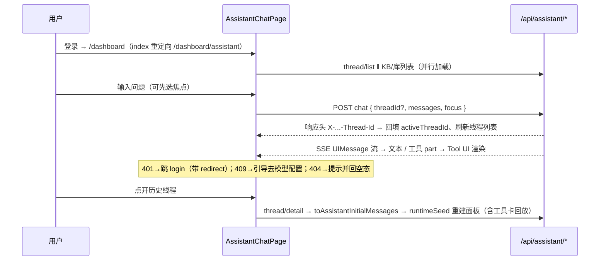

# agent-chat-shell design

## 0. 术语约定

| 术语 | 定义 | 防冲突结论 |
|------|------|-----------|
| assistant 壳 | 新前端主界面（`features/pages/assistant/`），即 roadmap 模块 Chat Shell | 与 `components/assistant-ui/`（通用 UI 基件库，非页面）、对外 `/api/agent/**` 产品线均不同物；grep 无 `AssistantPage` / `assistantApi` 现存命名 |
| 通用 Thread 组件 | `components/assistant-ui/thread.tsx` 导出的 `Thread`（完整对话面板：viewport / composer / welcome / reasoning / tool-group / ToolFallback），**当前全仓零使用者** | 旧 QA 页各自内联实现 Grok 风格 thread，不引用它；本条让它首次有消费者 |
| 焦点 focus | 契约 4.1 的 `focus` 对象；后端已有 `AssistantFocus`（`domain-types.ts`）与归属校验 | 前端沿用同名；与旧 QA 页的「scope」概念等价但不复用其命名 |
| 轻工具卡 | 壳内用 `makeAssistantToolUI` 渲染的简单状态卡（标题 + 状态 icon + 摘要行），参考旧 QA 页 `ToolStatusCard` 交互模式但**新实现**，落 assistant 页目录 | 新词仅本 design 使用；不 import 旧 QA 页内部组件 |
| 数据概览页 | 现 `/dashboard` index 的 `DashboardMetricsPage`，本条迁至 `/dashboard/metrics` | 页面本体零改动，只换挂载路径 |

## 1. 决策与约束

**需求摘要**：为已就绪的 assistant 后端（runtime-core + tools-readonly，共 12 只读工具）建 Chat-first 前端壳并设为登录后默认落地页。成功标准（= roadmap 最小闭环）：登录用户在**一个对话**里能问「有多少个知识库」看到真实计数、检索并阅读知识库内容（含引用 Tool UI）、检索并阅读文档库内容；线程可列出 / 打开回放 / 删除；焦点可选 KB 或文档库。

**复杂度档位**：走 Web 前端默认档位；唯一偏离——接口稳定性 = 高（消费的 chat / thread / 工具输出契约由 roadmap 4.1 / 4.3 / 4.5 锁定，前端不得私改字段或路径）。

**关键决策**（即用户要求的拍板点，替代方案随条附）：

1. **默认路由 = `/dashboard/assistant`（专属路径），`/dashboard` index 改为 `<Navigate replace>` 到它**；被顶掉的 `DashboardMetricsPage` 迁至 `/dashboard/metrics` 并给侧栏入口，页面本体零改动。理由：专属路径可链接、可做 legacy-retire 的重定向目标、后续线程深链有落点。替代方案（未选）：`/dashboard` index 直接渲染壳——省一跳，但 assistant 无独立路径，旧 QA 重定向目标含糊，且 metrics 同样要挪。
2. **对话面板基座 = 复用通用 Thread 组件，不复刻旧 QA 单体**。`KnowledgeQaPage`（2634 行）/ `DocLibraryQaPage`（2369 行）是双胞胎单体，拷贝即复制债务；通用 Thread 零使用者、功能完整，壳只需在外层包 runtime provider + Tool UI 注册。预期对 `thread.tsx` 本体零改或近零改（仅在缺建议区之类的极小缺口时做最小接线）。
3. **焦点选择器放对话面板顶部的焦点栏（AssistantFocusBar），不塞进通用 Composer**；三选：不限 / 某知识库 / 某文档库。选择随**每轮请求** `body.focus` 发送（后端 toolContext 按轮取 focus，中途换焦点无需强制新开线程）；新线程创建时由后端落入 `focus_json`；打开历史线程时从 `thread.focus` 恢复选择。article / document 级焦点本条不做选择器（契约支持，入口留给后续条目）。
4. **本条不做模型选择器**：chat 请求不发 `configId`，由后端解析默认 CHAT 配置；409 `model_not_configured` 时界面给出去 `/dashboard/ai/config` 配置的引导。理由：最小闭环不含模型切换；assistant 无对应 model-info 端点，为选择器新开后端接口超出本条（后端零 diff 约束）。
5. **线程侧栏交互对齐旧 QA 页模式**（时间分组、搜索、单删 / 批量删、新对话），但按 thread API 契约 4.5 的形状实现（`items + nextCursor` 游标分页）；不做旧页的 scope 过滤条（assistant 线程无 KB 绑定列）。
6. **API 客户端追加进 `lib/api.ts`（`assistantApi`）**，遵守全仓「api client 单文件」现状约定，不为本条另立文件。

**明确不做**（可反向核对）：

- 后端零 diff：`apps/web/src/server/**` 与 `apps/web/app/api/**` 不改一行（发现缺口 → 停下来报告，不顺手改）
- 不动 `/api/agent/**` 相关前端页（`agent/keys|logs|mcp|skill` 零 diff）
- 不删不改旧 QA 入口：`/dashboard/qa`、`/dashboard/doc-library/qa` 路由与页面零 diff，与壳并存（拆旧归 agent-legacy-retire）
- 不接确认协议：不渲染 `request_user_confirmation` / 不 import `tool-ui/approval-card`（归 agent-confirm-write）
- 不做记忆 UI、计划持久化 / 韧性失败态 UI（`upsert_plan` 仅按输出渲染 Plan 卡）、`petrichor_assistant_artifact` 的浏览入口
- 不 import 旧 QA 页内部组件（`KnowledgeQaPage` / `DocLibraryQaPage` / `QaMarkdown` 不被 assistant 目录引用）

## 2. 名词与编排

### 2.1 名词层

**现状**（均指向代码位置）：

- 路由表 `lib/dashboard-routes.ts`：无 `assistant` / `metrics` 键；`client-app.tsx:141` index 挂 `DashboardMetricsPage`
- `lib/api.ts`（1912 行）：约 30 个 `xxxApi` 客户端，无 `assistantApi`
- 后端契约（消费侧，不改）：chat 请求 / 响应头见 `chat-handler.ts`（`{ threadId?, messages, configId?, focus? }` → SSE + `X-Petrichor-Assistant-Thread-Id/Run-Id`）；thread API 形状见 `thread-logic.ts`（`toAssistantThreadResponse` → `{ id, title, focus, createdAt, updatedAt }`；detail 的 `messages[].content` 是持久化的 UIMessage JSON——user 存整条消息、assistant 存 `{ parts }`）
- Tool UI 契约：`tool-ui/{citation,progress-tracker,data-table,plan}/schema.ts` 的 `safeParseSerializable*`；system 工具输出与之逐一对齐（`tools/system.ts`）
- 通用 Thread：`components/assistant-ui/thread.tsx` 导出 `Thread`，零使用者

**变化**：

1. 新增 `assistantApi`（`lib/api.ts`）+ 响应类型，形状照抄 thread-handlers（动机：壳的线程域数据源）：

```ts
// 来源：src/server/assistant/thread-handlers.ts + thread-logic.ts
assistantApi.threadList({ cursor?, limit?, q? })   // → { items: AssistantThreadSummary[], nextCursor: number | null }
assistantApi.threadDetail({ threadId })            // → { thread, messages: [{ id, role, content, createdAt }] }
assistantApi.threadCreate({ title?, focus? })      // → { thread }
assistantApi.threadDelete({ threadId })            // → { ok: true }
assistantApi.threadDeleteMany({ threadIds })       // → { deleted: number }
```

2. 新增前端值对象 `AssistantFocusSelection`（壳内部）与契约 focus 的映射（动机：UI 只需三态选择，契约字段是四个可选 id）：

```ts
type AssistantFocusSelection =
  | { kind: "none" }
  | { kind: "knowledge"; knowledgeBaseId: string }
  | { kind: "doc_library"; libraryId: string }
// 映射：none → focus: null；knowledge → { knowledgeBaseId }；doc_library → { libraryId }
// 恢复：thread.focus.knowledgeBaseId 优先，其次 libraryId，都无 → none
```

3. 新增组件树（`features/pages/assistant/`，状态归属标注）：

```
AssistantChatPage        页面编排；持线程列表 / activeThreadId / initialMessages / focus / runtimeSeed
├── AssistantThreadSidebar   线程列表 + 搜索 + 新对话 + 单删/批量删（props 下发，无自有请求）
├── AssistantFocusBar        焦点三态选择；数据源 knowledgeBaseQaApi.knowledgeBaseList() 与 docLibraryApi 列表
└── AssistantChatPanel       useChatRuntime + AssistantChatTransport(/api/assistant/chat) + Provider
     ├── <AssistantToolUIs/>  makeAssistantToolUI 注册集（见 2.3 后的注册清单）
     └── <Thread/>            复用通用 Thread 组件
```

4. 新增消息回放转换 `toAssistantInitialMessages`（thread/detail 的 `content` JSON → 通用 Thread 可消费的 UIMessage[]；user 取整条、assistant 取 `{ parts }` 包装）
5. 路由表新增 `dashboardRoutes.assistant` / `dashboardRoutes.metrics` 两键

**Tool UI 注册清单**（拍板点 4；12 锁名工具全覆盖 + fallback）：

| 工具 | 渲染 | 复用/新建 |
|------|------|----------|
| `show_citations` | `CitationList`，站内引用导航：文章 → `knowledgeBaseArticlePath`、文档 → `docLibraryDocumentPath`、外链新窗 | 复用 tool-ui |
| `show_progress` | `ProgressTracker` | 复用 tool-ui |
| `show_data_table` | `DataTable`（含可选 title） | 复用 tool-ui |
| `upsert_plan` | `Plan`（仅渲染工具输出，同 id 重复调用即显示最新态） | 复用 tool-ui |
| `list_system_overview` | 轻工具卡：计数 + 模型就绪 badge | 新建 |
| `list_knowledge_bases` / `list_doc_libraries` | 轻工具卡：名称 badge 列表 | 新建 |
| `search_knowledge` / `search_documents` | 轻工具卡：命中条目（标题 + 摘要，可折叠） | 新建 |
| `read_knowledge_node` / `read_document` | 轻工具卡：标题 + 定位行 | 新建 |
| `save_answer_artifact` | 轻工具卡：标题 + 类型 badge | 新建 |
| 其余 / 未注册 | `ToolFallback`（通用 Thread 自带） | 复用 |

### 2.2 编排层



**现状**：登录后 index 渲染数据概览页；assistant 后端可用但无任何前端消费者（`architecture/runtime-assistant.md`「仍无前端入口」）；旧 QA 页各挂各的旧栈 API，编排模式（transport fetch 包装读响应头回填线程、runtimeSeed 重建 runtime、onFinish 刷新列表）已在 `KnowledgeQaPage.tsx` 验证过。

**变化**：新增 assistant 页的线性编排（加载 → 提问 → 流式渲染 → 回放），拓扑无升级；对既有路由编排仅两处改动——index 重定向与 metrics 换挂载点；侧栏 nav 数据加「助手」与「数据概览」项。

**流程级约束**：

- 每轮请求必须读 `X-Petrichor-Assistant-Thread-Id` 回填（首轮后端自动建线程，前端不得自行预建）；`thread/create` 仅在用户显式「新对话 + 预设焦点」时才需要，最小闭环允许不调用
- 焦点是「每轮请求快照」语义：切换焦点不重建线程、不清空消息；恢复只发生在打开历史线程时
- 错误语义（流开始前，非流 JSON）：401 → 跳 `/login?redirect=...`；409 → 界面引导配置模型（不白屏）；404（线程被删）→ 提示 + 清空选中 + 刷新列表；流中断 → 通用 Thread 的 ErrorPrimitive 呈现，已渲染内容保留
- 回放幂等：同一 threadId 重复打开渲染结果一致（纯函数转换，不写库）
- 可观测点：沿用后端 run/step 落库，前端不加自有埋点

### 2.3 挂载点清单

1. 路由注册：`client-app.tsx` — 新增 `/dashboard/assistant` 与 `/dashboard/metrics` 路由，index 改为重定向（修改）
2. 路由表：`lib/dashboard-routes.ts` — 新增 `assistant` / `metrics` 两键（新增）
3. 侧栏入口：`components/app-sidebar.tsx` — 新增「助手」nav 项（置于智能应用组首）与「数据概览」项（修改）
4. API 客户端：`lib/api.ts` — 新增 `assistantApi`（新增）

删掉这 4 处（含 index 重定向回滚），assistant 壳在用户视角完全消失，`features/pages/assistant/` 目录变成死代码可整体删除。

### 2.4 推进策略

1. 静态结构：路由 + 侧栏 + 页面骨架（线程栏占位、通用 Thread 空态）→ 退出：登录访问 `/dashboard` 落到 assistant 壳，肉眼见完整布局
2. 对话流接入：transport 接 `/api/assistant/chat`、SSE 渲染、响应头回填 → 退出：问「有多少个知识库」得到流式回答（工具卡此时可为 fallback）
3. Tool UI 注册：12 工具 + fallback + 引用站内导航 → 退出：引用 / 表格 / 计划 / 进度卡按各自组件渲染，引用可点击跳转
4. 线程域接入：assistantApi + 列表 / 详情回放 / 删除 / 批量删 / 新对话 → 退出：历史线程可打开且工具卡完整回放
5. 焦点选择器：AssistantFocusBar + 每轮携带 + 历史恢复 → 退出：选定文档库后提问，检索限定在该库且引用可跳文档
6. 联调收尾：错误路径（401 / 409 / 404）+ 全量验收场景 → 退出：第 3 节场景清单全部有可观察证据

### 2.5 结构健康度与微重构

compound 检索：`.codestable/compound/` 不存在（无已归档 convention），跳过按档执行、直接评估。

##### 评估
- 文件级 — `client-app.tsx`（185 行）：加 2-3 个路由行，单一职责（路由装配），健康
- 文件级 — `lib/dashboard-routes.ts`（65 行）/ `components/app-sidebar.tsx`（310 行）：各加两键 / 两 nav 项，健康
- 文件级 — `lib/api.ts`（1912 行）：**已远超 500 行阈值**，但职责单一（全部 api client 的既有归属约定），本次仅尾部追加一段 ~40 行，不触发拆分收益
- 文件级 — `components/assistant-ui/thread.tsx`（450 行）：预期零改或近零改，不评估拆分
- 目录级 — `features/pages/`：14 个子目录、按 domain 分组的稳定模式，新增 `assistant/` 顺延该模式，不摊平
- 目录级 — `features/pages/assistant/`（新建）：design 已按组件树切 5 ± 文件，不会复刻单文件单体

##### 结论：不做

本次不做微重构，原因：所有被改文件改动量小且职责清晰；唯一超标的 `api.ts` 属全仓既有约定，单独为本条拆它风险大于收益。

##### 超出范围的观察（仅提示不阻塞）
- `lib/api.ts`（1912 行）：类型 + 客户端混排的单体，建议后续走 `cs-refactor` 按域拆分
- `KnowledgeQaPage.tsx`（2634 行）/ `DocLibraryQaPage.tsx`（2369 行）：双胞胎单体（UI + 传输 + 工具渲染混写）；本条不动，其去留归 agent-legacy-retire，若在退役前要维护可走 `cs-refactor`

## 3. 验收契约

**关键场景**（输入 / 触发 → 期望可观察结果）：

正常路径：
1. 登录后访问 `/dashboard` → URL 变为 `/dashboard/assistant`，见空态壳（欢迎区 + composer + 线程栏）
2. 问「有多少个知识库」→ `list_system_overview` 轻工具卡出现，回答含与数据库一致的真实计数
3. 不选焦点问知识库内容 → 检索 / 阅读工具卡 + `CitationList` 渲染，点引用跳转到站内文章页
4. 焦点选某文档库后提问 → `search_documents` / `read_document` 卡 + 引用，内容限定该库
5. 场景 2-4 在**同一线程**连续完成（最小闭环：一个对话）→ 线程 detail 含全部轮次
6. 首问后线程列表自动出现新线程（标题为首问摘要）；点开历史线程完整回放文本与工具卡
7. 侧栏单删 / 批量删线程 → 列表移除；删的是当前线程则回空态
8. 打开带 focus 的历史线程 → 焦点栏显示对应 KB / 库名
9. 诱导多步任务（如「分步整理……先列计划」）→ `upsert_plan` 输出渲染为 Plan 卡

边界：
10. 零线程 / 搜索无命中 → 空态提示，不报错
11. 线程在别处被删后继续发消息 → 404 提示 + 可一键新开对话

错误路径：
12. 未配置 CHAT 模型 → 409 呈现为「去配置模型」引导（链接 `/dashboard/ai/config`），不白屏
13. 会话过期发消息 → 401 跳 `/login?redirect=/dashboard/assistant...`，登录后回到壳

**明确不做的反向核对**：
- `git diff` 中 `apps/web/src/server/**`、`apps/web/app/api/**` 零改动
- `/dashboard/qa`、`/dashboard/doc-library/qa` 路由仍存在且页面文件零 diff
- `features/pages/assistant/**` 内 grep 不到 `approval-card`、`KnowledgeQaPage`、`DocLibraryQaPage`、`QaMarkdown`、`propose_wiki_patch`
- chat 请求体不含 `configId`（网络面板可查）

## 4. 与项目级架构文档的关系

- **名词**：assistant 壳的路由挂载（`/dashboard/assistant` 为默认落地）、`assistantApi` 客户端 → acceptance 后归并进 `architecture/runtime-assistant.md`，并把「仍无前端入口」句改写为现状
- **动词骨架**：前端「响应头回填线程 + runtimeSeed 回放」编排与焦点每轮快照语义 → 同 doc「结构与交互」节
- **流程级约束**：Tool UI 注册与工具输出 schema 的对齐关系（12 锁名工具 ↔ tool-ui 组件）→ 同 doc「已知约束」
- `ARCHITECTURE.md` 总入口：为 Chat Shell 增一句描述（登录后默认主界面，消费 assistant 运行时）

## 实现纠偏（2026-07-10）

原 design 以通用 `components/assistant-ui/thread.tsx` 为基座的薄壳方案已废弃：会丢失 KnowledgeQaPage 的 Grok 流式交互、工具卡与侧栏体验。

实际实现改为：**以 KnowledgeQaPage 的 Grok UI 为基座**，改接 `/api/assistant/*`、三态 focus（全部/知识库/文档库）、12 个 assistant 锁名工具 UI；共享 `thread.tsx` 文案改动已回滚。旧 `/dashboard/qa` 页面文件保持零 diff。
