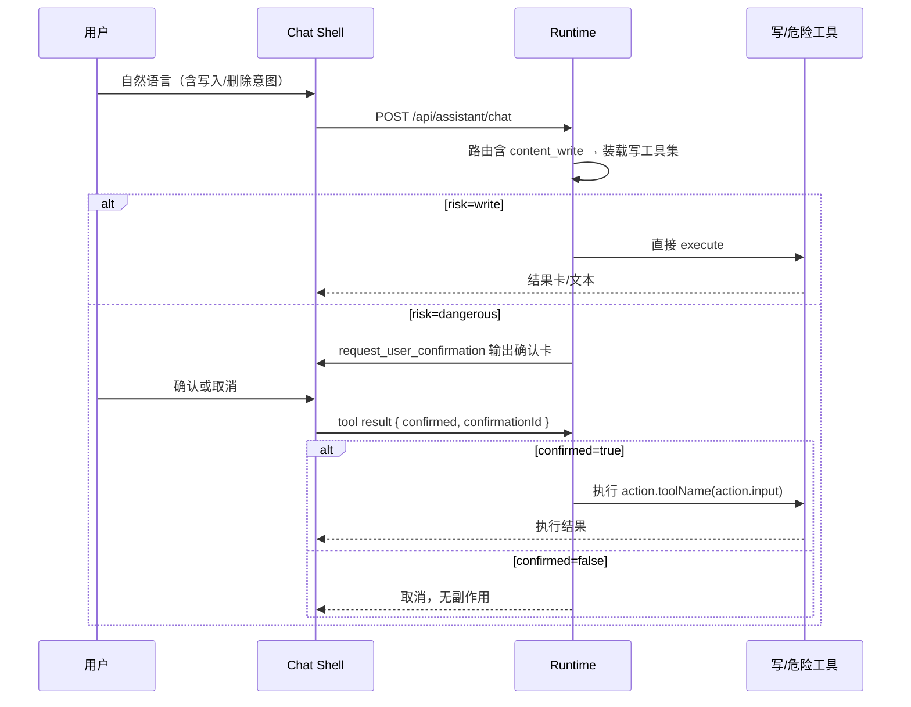

# agent-confirm-write design

## 0. 术语约定

| 术语 | 定义 | 防冲突结论 |
|------|------|-----------|
| 确认卡 | 工具 `request_user_confirmation` 的输出，对齐 `ApprovalCard` schema 并扩展 `action` / `risk` | 组件已在 `tool-ui/approval-card`；旧 Wiki 补丁审批不复用、不复活 |
| 确认回传 | 客户端 tool result：`{ confirmed, confirmationId }` | 契约 4.4；与 ApprovalCard 的 `choice: approved\|denied` 在壳内映射 |
| 危险白名单 | roadmap 4.4 列出的 `article.delete` 等逻辑动作名 | 本条工具 `risk=dangerous` 必须映射到其中一项；admin 类留给 `agent-tools-admin` |
| 写工具 | `domain=content_write` 且 `risk=write`，可直接执行 | 与 `save_answer_artifact`（system/write）区分：本条只做业务内容写入 |

## 1. 决策与约束

**需求摘要**：对话里能安全地改内容——普通写入直接执行；删除/撤分享等危险动作必须先出确认卡，用户确认后 Runtime 才执行副作用。

**复杂度档位**：接口稳定性 = 高（确认协议由契约锁定）；写工具名本期在 design 锁定最小集（roadmap 4.3 未锁写工具名，本条锁定后若要改走 roadmap update）。

**本稿默认倾向（不同意再说）**：

1. **确认编排**：模型只调用 `request_user_confirmation` 发起危险操作；**危险工具不进入模型可见 `activeTools`**，仅注册供 Runtime 在 `confirmed=true` 后按 `action.toolName` 执行。直接调用危险工具名 → 拒绝（返回错误，无副作用）。
2. **`request_user_confirmation` 域**：挂在 `content_write`（与写意图同装载）。admin 条再开时：路由命中 `admin` 时一并装载 `content_write` 以拿到确认工具，或另开 roadmap 补丁——**本条不改 admin**。
3. **一期写工具最小集**（只这些）：

| name | risk | 白名单映射 | 行为 |
|------|------|------------|------|
| `request_user_confirmation` | read | — | 回显确认卡；无业务副作用 |
| `create_article` | write | — | 在指定知识库创建文章 |
| `update_article` | write | — | 更新文章标题和/或正文 |
| `create_article_share` | write | — | 开启文章公开分享 |
| `delete_article` | dangerous | `article.delete` | 删除文章 |
| `revoke_article_share` | dangerous | `share.revoke` | 撤销分享 |
| `delete_document` | dangerous | `document.delete` | 删除文档库文档 |

4. **壳 UI**：消息流内渲染确认卡（交互必需，不是进度那种旁路）；确认/取消 → `addToolResult` 回传。
5. **复用**：写/删逻辑调用既有 KB / doc-library / share 服务端能力（归属校验照旧），不平行造一套。

**明确不做**：

- `folder.delete` / `knowledge_base.delete` / `document.bulk_delete` / 移动重命名 / 文档库建文
- admin 白名单项（`ai_config.*` / `agent_api_key.revoke` / `public_qa.disable`）→ `agent-tools-admin`
- 复活 `propose_wiki_patch` 或旧 QA 审批流
- 改 `/api/agent/**`、MCP、Skill
- 新表（确认态用消息 parts + 本 run 内存/消息链即可）

## 2. 名词与编排

### 2.1 名词层

**现状**：注册表仅 knowledge/doc_library/system；`risk` 字段已有但无 dangerous 执行路径；壳无 `ApprovalCard` 接线；契约 4.4 未实现。

**变化**：

- 新增 `content_write` 工具包注册（上表 7 个名）。
- 确认卡输出 = ApprovalCard 字段 +：

```
action: { toolName: string, input: Record<string, unknown> }
risk: "dangerous"
```

- 回传：`{ confirmed: boolean, confirmationId: string }`（`confirmationId` === 卡 `id`）。

### 2.2 编排层



**约束**：确认前后同一 `userId` 归属校验；取消不得产生写副作用；确认卡过期/id 不匹配 → 不执行。

### 2.3 挂载点

1. `content_write` 工具注册（含确认工具 + 最小写/危险集）  
2. Runtime：确认回传后执行 `action.toolName`；危险工具不对模型暴露  
3. 壳：`request_user_confirmation` → ApprovalCard + tool result 回传  
4. 系统提示：写意图可用工具纪律 + 危险必须走确认  

### 2.4 推进策略

1. 确认协议骨架（工具 + Runtime 执行器 + 单测）→ 退出：假危险工具确认/取消行为正确  
2. 三个 dangerous + 三个 write 接真实业务 → 退出：归属错误不写库  
3. 壳确认卡接线 → 退出：UI 确认后库变更可见  
4. 提示词 + 场景收尾 + 架构回写  

### 2.5 结构健康度

- 新文件落 `src/server/assistant/tools/content-write.ts`（及确认辅助模块若需要，如 `confirmation.ts`），不往 `chat-handler.ts` 继续堆业务。  
- **本次不做目录重组**；`tools/` 已按域分文件，模式健康。  
- 超出范围观察：`AssistantChatPage.tsx` 仍偏胖——确认卡接线尽量局部，大拆归后续 refactor，不阻塞本条。

## 3. 验收契约

1. 「帮我在某知识库新建一篇…」→ `create_article` 直接成功，无确认卡。  
2. 「删除文章 X」→ 出现确认卡；点取消 → 文章仍在。  
3. 同上 → 点确认 → 文章删除；step 落库含确认与执行。  
4. 「撤销分享」→ 确认后 `share.revoke` 生效。  
5. 「删除文档」→ 确认后文档删除。  
6. 模型若试图直接调 `delete_article` → 无副作用并得到拒绝结果。  

反向：无 admin 工具；无 folder/kb 删除；无 `propose_wiki_patch`；不改 `/api/agent/**`。

## 4. 架构

验收后更新 `architecture/runtime-assistant.md`（确认协议 + content_write 域）。
