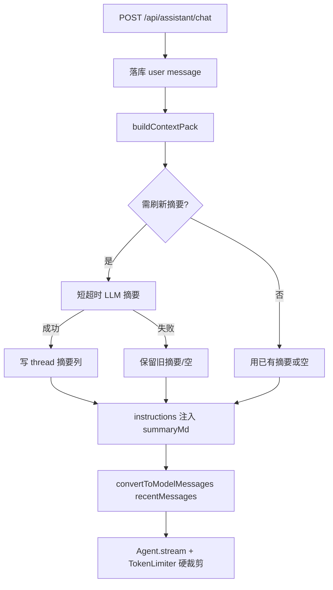

# agent-context-compress design

## 0. 术语约定

| 术语 | 定义 | 防冲突结论 |
|------|------|-----------|
| 语义压缩 | 用模型把较早消息折叠成中文摘要，再注入本轮上下文 | 区别于 `TokenLimiterProcessor` 的硬裁剪（丢弃尾部/连续块） |
| ContextPack | `buildContextPack` 返回值：摘要 + 未折叠最近消息 | roadmap 契约 4.9；本 feature 首次落地 |
| 摘要水位 | `context_summary_until_message_id`：摘要已覆盖到的最后一条持久化 message.id | 与客户端本轮 `messages[]` 对齐时，以服务端已落库消息为准推进水位 |

## 1. 决策与约束

**需求摘要**：长对话不再只靠硬裁剪「砍掉旧消息」；在装载 Mastra Agent 前，把较早轮次压成线程级摘要，保留最近细节，降低跑偏与 token 浪费。

**复杂度档位**：默认 Web 后端；增量列 + 一次摘要 LLM 调用；无新 HTTP 面。

**本稿默认倾向（假设，可反驳）**：

1. **触发条件（满足任一）**：本轮待送模型的消息估算 token 超过 `MAX_CONTEXT_TOKENS * 0.55`，或持久化消息条数 > 20；且存在可折叠的「水位之后、最近窗口之前」的消息。未触发则 `summaryMd` 用已有摘要（若有）或 null，不调摘要模型。
2. **最近窗口**：固定保留最近 **6** 条 UIMessage（契约下限）；不按「3 轮」再分叉，避免实现歧义。
3. **摘要时机**：在 `Agent.stream` **之前同步**调用一次短超时摘要（建议 ≤8s）；失败/超时 → 本轮仅硬裁剪，不阻断对话、不写坏水位。
4. **增量摘要**：已有 `context_summary_md` 时，只把「水位之后 → 窗口之前」的新段落并入摘要，再更新水位与时间戳。
5. **注入方式**：`summaryMd` 拼进本轮 `instructions` 的固定前缀段（「以下是本对话较早内容的摘要…」），`recentMessages` 再 `convertToModelMessages`；不伪造 user/assistant 气泡进客户端历史。
6. **压缩中 UI（必做）**：SSE **先开流**再跑摘要。写入临时 data part `data-context-compress`（`status: running | done | skipped | failed`，文案如「正在整理对话上下文…」）；壳在助手气泡首字前渲染该状态（复用/对齐 `QaPreparing` 视觉）。摘要结束后更新为 done/skipped/failed；**落库助手消息时剥离**该临时 part，避免历史里永久留「压缩中」。

**明确不做**：

- 不新增 `/api/assistant/**` 压缩专用接口
- 不替代或移除 `TokenLimiterProcessor`
- 不把确认卡未决态、API Key、Cookie 写入摘要
- 不做跨线程全局记忆（记忆 feature 已 cancelled）
- 不做向量检索式「相关历史召回」；本条只做时间序摘要折叠
- 不改对外 `/api/agent/**`

## 2. 名词与编排

### 2.1 名词层

**现状**：

- `petrichor_assistant_thread` 仅有 title / focus / 软删（`schema.ts`）
- `chat-handler`：客户端 `messages` →（确认补丁）→ `convertToModelMessages` → `Agent.stream`；`TokenLimiterProcessor(limit=100_000)` 硬裁剪
- 消息落库 `persistAssistantMessage`，但装载模型主要用客户端提交的整段 `messages`

**变化**：

```
// 线程扩展列（契约 4.9）
context_summary_md text null
context_summary_until_message_id bigint null
context_summary_updated_at timestamptz null

type ContextPack = {
  summaryMd: string | null
  recentMessages: UIMessage[]
  compressedMessageCount: number
}

buildContextPack({ threadId, userId, messages, tokenBudget }) → ContextPack
maybeRefreshThreadSummary(...) → void  // 触发时写库；失败吞掉
```

接口示例：

- 输入：thread 已有 40 条消息，本轮 messages 很长 → 输出：`summaryMd` 非空、`recentMessages.length === 6`、`compressedMessageCount > 0`
- 输入：新线程 3 条消息 → 输出：`summaryMd=null`、`recentMessages` 即全部、`compressedMessageCount=0`
- 输入：摘要 LLM 超时 → 输出：与「未刷新」等价的 pack（旧摘要可保留），对话继续

### 2.2 编排层



流程级约束：

- 摘要与主回答共用用户模型配置；摘要失败不得把 run 标 FAILED
- 写摘要必须 `thread.user_id = 当前用户`
- `compressedMessageCount` 仅描述本 pack，不要求落 step

### 2.3 挂载点

1. `assistantThreads` 三列 + 迁移 SQL  
2. `buildContextPack` / 摘要刷新（新模块文件）  
3. `chat-handler`：stream 内先发压缩 UI → ContextPack → 再 Agent.stream  
4. 壳：`data-context-compress` 渲染  
5. （可选）架构 doc 一句：语义压缩已接线  

卸载：删挂载 2–4、忽略三列即可回退到「仅硬裁剪」。

### 2.4 推进策略

1. **持久化**：schema + 迁移列  
2. **编排骨架**：`buildContextPack` 窗口切分 + 触发判定（可先无 LLM，摘要恒 null）  
3. **计算节点**：摘要 LLM + 增量合并 + 写水位  
4. **接线**：chat-handler 流内压缩 + data part；壳渲染  
5. **测试**：窗口/触发/失败降级单测；UI part 类型约定  

### 2.5 结构健康度

- **文件**：`chat-handler.ts` 已偏长 → 压缩逻辑进新文件 `context-pack.ts`（或同级名），handler 只调用；**做微重构式落点：新文件承载，不先大拆 handler**  
- **目录**：`server/assistant/` 可容纳单文件，不重组  
- **结论**：本次不做目录重组；新逻辑默认新文件  
- **超出范围观察**：客户端 messages 与服务端落库不完全同源时的严格对齐，可后续再收紧，不阻塞本条

## 3. 验收契约

1. **短对话**：消息很少 → 不调用摘要模型；回答正常；摘要列仍空。  
2. **长对话触发**：人为构造超阈值历史 → 触发摘要后 `context_summary_md` 非空，水位前进；本轮 instructions 含摘要要点。  
3. **最近窗口**：摘要后模型仍能看到最近 6 条原始内容中的关键细节（用可测 fixture 断言 pack，不测模型智商）。  
4. **摘要失败**：mock 超时/抛错 → 对话仍流式完成；水位不前进；UI 可短暂 `failed` 后进入正常回答。  
5. **压缩中 UI**：触发摘要时，首字出现前可见「正在整理对话上下文…」（或等价文案）；历史回放无残留 running 态。  
6. **归属**：用户 A 不能写入/读到用户 B 的 thread 摘要。  
7. **硬裁剪仍在**：TokenLimiter 仍注册。  

反向核对：无压缩 HTTP API；无跨线程记忆；摘要不含伪造的确认/密钥字段要求（实现侧过滤 tool 明文密钥）。

## 4. 与项目级架构文档的关系

验收后更新 `architecture/runtime-assistant.md`：chat 流水线增加 ContextPack；thread 表三列；明确「语义压缩 + 硬裁剪」双层。
