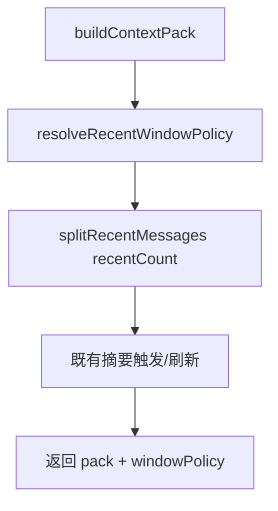

# agent-context-window-v2 design

## 0. 术语约定

| 术语 | 定义 | 防冲突结论 |
|------|------|-----------|
| windowPolicy | `{ recentCount, reason }`：本轮实际保留的最近消息条数与选型原因 | roadmap 契约 4.3；本条首次落地 |
| reason=fixed | 未扩张，停在下限 6（或消息总数 ≤6） | 与「硬编码永远 6」区分：下限仍 6，但可扩张 |
| reason=token_budget | 在 token 预算内扩张到 >6 | 主路径 |
| reason=turn_budget | 已顶到条数上限（MAX），即使 token 仍有余量也不再扩 | 防止窗口无限变大 |
| 向量召回 | recalledSnippets | **本条不做**，留给 `agent-context-vector-recall` |

## 1. 决策与约束

**需求摘要**：长对话在压缩时不再固定只留 6 条；在 token 允许时多留最近原文，下限仍 ≥6。

**复杂度档位**：默认 Web 后端，无偏离；无新表 / 无新 HTTP。

**本稿默认**：

1. `MIN=6`，`MAX=20`；最近窗口预算 = `tokenBudget * 0.35`
2. 从 MIN 向上试探，`estimateMessageTokens(slice) ≤ 预算` 则扩张；触顶 MAX → `turn_budget`
3. `ContextPack` 增加 `windowPolicy`；`splitRecentMessages` / `buildContextPack` 使用动态 `recentCount`
4. TokenLimiter 硬裁剪仍保留；摘要触发逻辑改为相对动态窗口（`messages.length > recentCount`）

**明确不做**：向量召回；改摘要模型提示；新 API；改壳 UI（除非透传字段，本条可不展示）。

## 2. 名词与编排

### 2.1 名词层

**现状**：`CONTEXT_RECENT_MESSAGE_COUNT=6` 固定；`ContextPack` 无 `windowPolicy`。

**变化**：

```
type ContextWindowPolicy = {
  recentCount: number
  reason: "fixed" | "token_budget" | "turn_budget"
}

type ContextPack = { ...existing, windowPolicy: ContextWindowPolicy }

resolveRecentWindowPolicy({ messages, tokenBudget }) → ContextWindowPolicy
```

### 2.2 编排层



流程级约束：`recentCount ≥ min(6, messages.length)`；失败路径仍带 `windowPolicy`。

### 2.3 挂载点

1. `context-pack.ts` 策略函数 + `ContextPack` 类型 — 修改  
2. `buildContextPack` 调用链 — 修改  

卸载：固定回传 `recentCount=6, reason=fixed` 即可回退观感。

### 2.4 推进策略

1. 策略纯函数 + 单测  
2. 接入 buildContextPack / shouldRefresh  
3. 架构一句 + 回归单测  

### 2.5 结构健康度

- `context-pack.ts` 可容纳；不做目录重组。  
- 结论：不做微重构。

## 3. 验收契约

1. 消息 ≤6 → `recentCount=消息数`（或全量）、`reason=fixed`  
2. 长对话、token 宽裕 → `recentCount>6` 且 ≤20，`reason=token_budget` 或触顶 `turn_budget`  
3. 单条极长导致无法扩张 → 仍 ≥6（有足够消息时）、`reason=fixed`  
4. 摘要触发仍可用；TokenLimiter 仍在  
5. 无 recalledSnippets 字段写入（本条）  

## 4. 架构

更新 `runtime-assistant.md`：ContextPack 含动态 windowPolicy。
