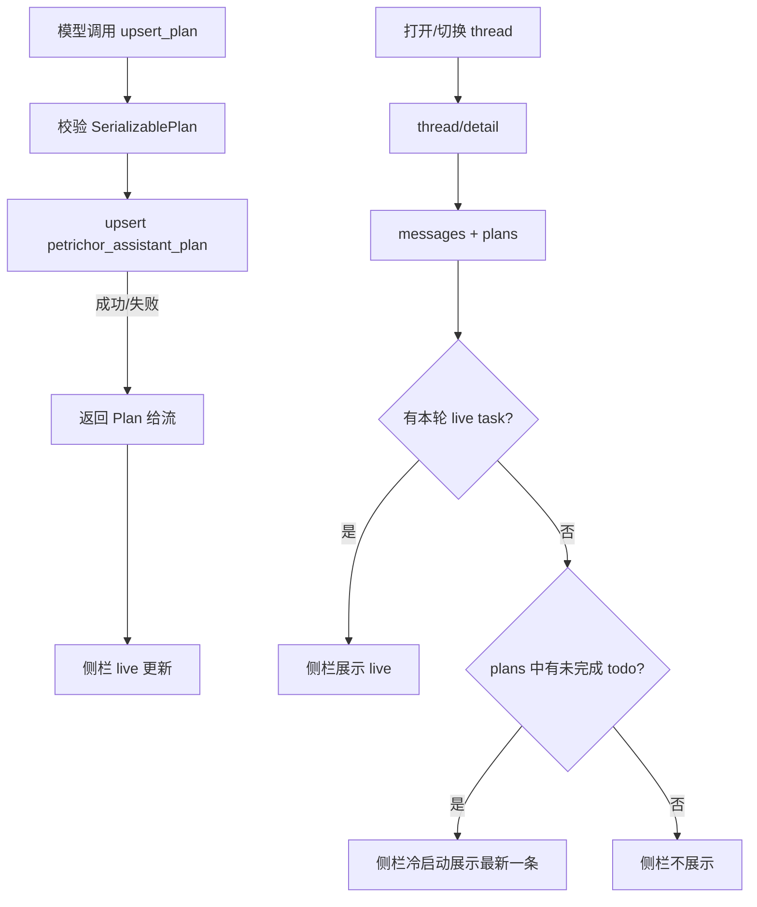

# agent-plan-persist design

## 0. 术语约定

| 术语 | 定义 | 防冲突结论 |
|------|------|-----------|
| Plan | `SerializablePlan`：`id` + title + todos（status ∈ pending/in_progress/completed/cancelled） | 沿用 `components/tool-ui/plan/schema`；不另造 schema |
| plan_key | 持久化行上的业务键，等于 `upsert_plan` 入参 `id` | 表列名 `plan_key`，避免与表 PK `id` 混淆 |
| Live Task | 本轮消息流里最新 `upsert_plan` / `show_progress` 解析出的侧栏态 | 现有 `AssistantTaskRail`；本条不改 progress 语义 |
| Persisted Plan | `petrichor_assistant_plan` 中 `status=active` 的行 | 本条新增；仅 Plan，不含 ProgressTracker |
| 冷启动 | 打开/切换 thread 后尚无本轮 live tool 输出时，侧栏用 `plans[]` 回放 | 与「仅本轮短暂展示」相对 |

## 1. 决策与约束

**需求摘要**：多步任务的 Plan 跨轮、跨刷新仍可在侧栏看到；`upsert_plan` 从「只回显」升级为「回显 + 落库」；成功标准是 thread.detail 能带回 active plans，侧栏无 live 时能展示未完成计划。

**复杂度档位**：走默认 Web 全栈档位，无偏离（一张新表 + 既有工具/侧栏扩展，无新 HTTP 路由）。

**本稿默认倾向（假设，可反驳）**：

1. **只持久化 Plan**：`show_progress` 仍纯回显、不落库（契约 4.1 只提 Plan）。
2. **侧栏优先级**：本轮 live（含 progress/plan）> `plans[]` 中 `updated_at` 最新且仍有未完成 todo 的一条；全部完成/取消的 active plan 冷启动**不自动弹出**（避免历史完成计划占位），但仍在 `plans[]` 里可查。
3. **归档策略**：本条不新增 `archive_plan` 工具；不自动 archive。行 `status` 默认 `active`；软删 thread 后 list/detail 不再返回（与 thread 同归属过滤即可，物理清理可延后）。
4. **多 plan_key**：同 thread 允许多条 active（不同 `plan_key`）；侧栏仍只展示一条（见优先级）。
5. **写库失败 fail-open**：`upsert_plan` 校验通过后仍返回 Plan 给 UI；落库失败记日志/不抛给模型，避免拖垮本轮工具链。
6. **risk 仍为 read**：落库是运行时书签，不是 content_write；工具名不变。

**关键决策**：

| 决策 | 为何 | 换做法会怎样 |
|------|------|--------------|
| 独立表而非 thread JSON 列 | 多 plan_key、按 key upsert、后续可 archive | 塞进 thread 列则多计划与索引都别扭 |
| 扩展 `thread/detail` 的 `plans?`，不新开 API | 冷启动与消息同一次加载 | 另开 list_plans 多一次往返、挂载点更多 |
| 侧栏改「live 优先，否则冷启动未完成」 | 兑现 sticky 回放，又不复活「历史卡住 Plan」 | 若永远只看 live，本 feature 对用户几乎无感 |

**明确不做**：

- 不持久化 `show_progress`
- 不新增 Plan 专用 HTTP 路由 / 管理页
- 不做韧性 playbook（`agent-resilience-playbook`）
- 不改 Plan todos 状态枚举；不引入第二套 Plan schema
- 不在消息流内恢复大 Plan 卡（仍侧栏；消息内 ToolUI 可继续空渲染）
- 不物理级联删 plan 行（软删 thread 后不可见即可）
- 不改 `/api/agent/**`

## 2. 名词与编排

### 2.1 名词层

**现状**：

- `upsert_plan`（`tools/system.ts`）：`SerializablePlanSchema.parse` 后原样返回；描述写明「不做持久化」
- `AssistantTaskRail`：从当前 thread messages 抽最新 live task；流结束后短暂 pin，再 dismiss；**不读服务端 plans**
- `getAssistantThreadDetail`：只返回 `thread` + `messages`
- 无 `petrichor_assistant_plan` 表

**变化**：

```
表 petrichor_assistant_plan
  id bigint PK
  thread_id / user_id bigint not null
  plan_key text not null              // = Plan.id
  title text not null
  description text null
  todos_json text not null            // Plan.todos JSON
  status text not null                // active | archived（本条只写 active）
  created_at / updated_at

唯一策略：应用层 upsert on (thread_id, plan_key) where 目标为 active
  （Postgres 可用部分唯一索引；SQLite 桌面路径用应用层保证）

upsert_plan(ctx, plan) →
  parse → upsert 行 → 返回同一 Plan 形状（失败落库仍返回 Plan）

thread/detail 响应（向后兼容）：
  {
    thread, messages,
    plans?: SerializablePlan[]     // 仅 active；按 updated_at desc
  }
```

接口示例：

- 输入：`upsert_plan` `{ id:"p1", title:"改文档", todos:[...] }` → 输出：同形状 Plan；库中 `(thread, p1)` 一行更新
- 输入：再次同 `id` 改 todos 状态 → 输出：新 Plan；同行覆盖 title/description/todos_json，`updated_at` 前进
- 输入：`thread/detail` 该 thread 有 2 条 active → 输出：`plans.length===2`，元素可被 `SerializablePlanSchema` 解析
- 输入：用户 B 的 threadId → 404，不泄露 A 的 plans
- 输入：落库抛错 → 工具结果仍为合法 Plan，对话继续

来源：契约 roadmap 4.1；Plan 形状来自 `SerializablePlanSchema`。

### 2.2 编排层



**现状拓扑**：线性「工具回显 → 消息 part → 侧栏从 messages 派生」。

**变化**：

1. 工具执行支线增加写库（与回显同事务非必须；失败不阻断回显）
2. thread 加载支线增加 `plans[]` → 侧栏冷启动回落

**流程级约束**：

- 写/读必须 `thread.user_id = 当前用户` 且 thread 未软删
- 幂等：同 `(thread_id, plan_key)` 重复 upsert 覆盖，不插第二行 active
- 顺序：侧栏派生时 live 覆盖 persisted；不把 persisted 写回消息 parts
- 可观测：可选在 step 已有 output 中看到 Plan；不必为落库另加 error_code
- 扩展点：日后 `archive` 只改行 status；list 过滤不变

### 2.3 挂载点清单

1. **DB**：`petrichor_assistant_plan` 表 + `docs/migrations/` SQL（及 schema / full-migration 登记）— 新增  
2. **工具**：`upsert_plan` 执行语义（回显 + upsert）— 修改  
3. **API 响应**：`getAssistantThreadDetail` / `AssistantThreadDetailResponse.plans?` — 修改  
4. **壳**：`AssistantTaskRail`（及加载 thread 时传入 persisted plans）— 修改  

卸载：停写库 + detail 不返回 plans + 侧栏忽略 persisted；表可留空。

### 2.4 推进策略

1. **持久化骨架**：schema + 迁移 + upsert/list-by-thread 读写（可先无工具接线）  
   退出：单测覆盖 upsert 覆盖同 key、归属过滤  
2. **工具接线**：`upsert_plan` 写库 + fail-open；更新工具描述  
   退出：system 单测断言写库被调用且返回仍可 parse  
3. **Detail 扩展**：detail 带 `plans[]`；api 类型同步  
   退出：thread-logic 单测 / 契约断言  
4. **侧栏冷启动**：loadThread 注入 plans；live 优先、未完成才展示  
   退出：TaskRail 单测覆盖优先级与「全完成不弹出」  
5. **收尾**：提示词若仍写「不做持久化」则改掉；架构一句；迁移说明  

### 2.5 结构健康度与微重构

##### 评估

- 文件级 — `tools/system.ts`（~157 行）：职责仍是 system 工具集；本条只改一个 execute，改动密度低  
- 文件级 — `AssistantTaskRail.tsx`（~236 行）：将增加 persisted 输入与优先级；仍单职责「侧栏任务」  
- 文件级 — `AssistantChatPage.tsx`（~2650 行）：已偏胖；本条 ideally 只多传 props / 状态，不在此堆 Plan 逻辑  
- 目录级 — `server/assistant/`：已有多文件，可再加 `plan-store.ts`（或同级名）承载表读写，不摊平危机  
- compound：无 convention 目录可查，按现有 assistant 模块习惯「新逻辑优先新文件」

##### 结论：不做目录重组；落点倾向新文件承载持久化

- 表读写进新模块（如 `plan-store.ts`），`upsert_plan` / `getAssistantThreadDetail` 只调用  
- 不先大拆 `AssistantChatPage`

##### 超出范围的观察

- `AssistantChatPage.tsx` 体量过大 → 建议后续 `cs-refactor`，不阻塞本 feature

## 3. 验收契约

1. **首次 upsert**：对话中调用 `upsert_plan` → 返回合法 Plan；同 thread 查库有对应 `plan_key` 行。  
2. **同 key 更新**：再次同 `id` 改 todo 状态 → 仍一行；`todos_json` / `updated_at` 更新。  
3. **detail 回放**：刷新或重新 `thread/detail` → `plans` 含该 Plan，且可通过 `SerializablePlanSchema`。  
4. **侧栏冷启动**：有未完成 todo 的 active plan、无本轮 live → 侧栏展示该计划；用户可手动关闭。  
5. **全完成不打扰**：todos 全是 completed/cancelled、无 live → 冷启动侧栏不自动弹出。  
6. **live 优先**：本轮有新的 `upsert_plan`/`show_progress` → 侧栏跟 live，不被旧 persisted 盖住。  
7. **归属**：用户 A 不能读到用户 B thread 的 plans；软删 thread 的 detail 404，plans 不可见。  
8. **fail-open**：mock 写库失败 → 工具仍返回 Plan，流可继续。  

反向核对：无 progress 落库；无新 Plan HTTP；无消息内大 Plan 卡回归；工具名仍为 `upsert_plan`。

## 4. 与项目级架构文档的关系

验收后更新 `architecture/runtime-assistant.md`：数据层增加 plan 表；`upsert_plan` 持久化；detail 带 `plans`；侧栏 live > persisted。
