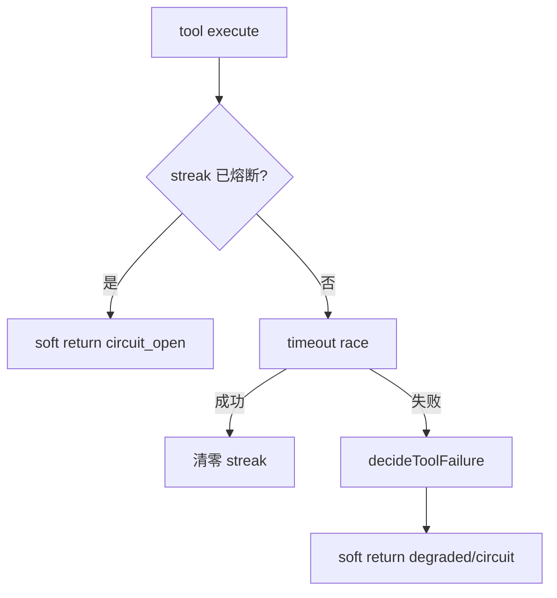

# agent-resilience-playbook design

## 0. 术语约定

| 术语 | 定义 | 防冲突结论 |
|------|------|-----------|
| ResilienceDecision | `{ action, messageForModel }` | 契约 4.2 |
| tool_degraded | 已降级，模型应换招或直接答 | 新增 error_code |
| tool_circuit_open | 本 run 该工具名已熔断 | 替代/覆盖耗尽后的对外码；内部仍可记 streak |
| PlaybookToolResult | `{ ok:false, errorCode, action, message }` 软回传 | 不自动换工具执行 |

## 1. 决策与约束

**需求**：失败时给模型可执行的换招文案；熔断后不再打同一工具。

**默认**：
1. `decideToolFailure` 纯函数；超时/首败 → `retry_other_tool` + `tool_degraded`；接近/达到耗尽 → `circuit_open` + `tool_circuit_open`
2. Controller 失败改为 **soft return** PlaybookToolResult（不 throw 给模型）；meta.errorCode 仍供 step 记 FAILED
3. 超时仍 30s；不自动代执行其他工具；dangerous/确认路径不动

**不做**：改超时默认值；Langfuse；自动静默换工具执行。

## 2. 名词与编排

### 2.1 名词层

扩展 `ToolResilienceErrorCode`；新增 `decideToolFailure` / `PlaybookToolResult`。

### 2.2 编排层

### 2.3 挂载点

1. `tool-resilience.ts` playbook — 修改  
2. 系统提示一句识别 playbook 结果 — 修改  

### 2.4 推进策略

1. decide + soft return + 单测  
2. 提示词 + step 输出兼容  
3. 架构一句  

### 2.5 结构健康度

落在既有 `tool-resilience.ts`；不做目录重组。

## 3. 验收契约

1. 首次失败 → soft result `tool_degraded` + action `retry_other_tool`  
2. 连败耗尽后再调 → `tool_circuit_open`，不执行真实逻辑  
3. 超时 → degraded，message 含换招指引  
4. 中间成功仍清零 streak  
5. 无自动代执行其他工具名  

## 4. 架构

更新 `runtime-assistant.md` 韧性段。
