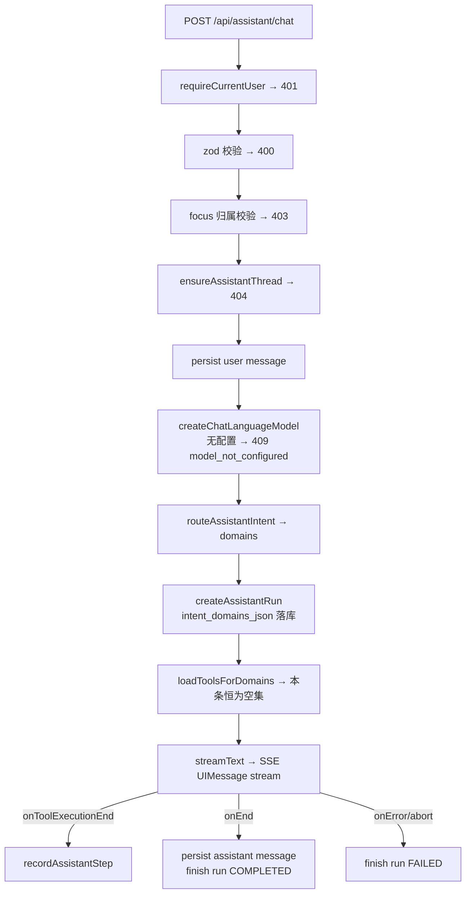

# agent-runtime-core design

## 0. 术语约定

| 术语 | 定义 | 防冲突结论 |
|------|------|-----------|
| Assistant（站内助手） | 站内统一对话运行时，本 feature 新建 | 与对外「Agent」产品线严格区分：对外线是 `/api/agent/**`、`petrichor_agent_*` 表、`src/server/agent/`。本 feature 一律用 `assistant` 前缀：路由 `/api/assistant/**`、表 `petrichor_assistant_*`、模块 `src/server/assistant/`、响应头 `X-Petrichor-Assistant-*`（现存头是 `X-Petrichor-Agent-*`，不混用） |
| 域（AgentDomainId） | `knowledge / doc_library / system / content_write / admin` 五值，roadmap 4.2 锁定 | 全仓 grep 无 `AgentDomainId` 冲突 |
| run / step | 一次流式回答 = 一个 run；一次工具调用 = 一个 step | 沿用现有 KB / doc QA 同名语义（`petrichor_kb_agent_run` 等），新表独立不共享 |
| 域工具注册表 | 进程内 registry，`registerAssistantTools` / `loadToolsForDomains`，roadmap 4.3 锁定 | 全仓 grep 无冲突 |
| 意图路由 | `routeAssistantIntent`，每轮先跑、决定装载哪些域的工具，roadmap 4.2 锁定 | 全仓 grep 无冲突 |

## 1. 决策与约束

**需求摘要**：为 chat-first-universal-agent 提供运行时底座——新建 `POST /api/assistant/chat`（SSE 统一对话）、5 张 `petrichor_assistant_*` 表、5 条 thread API、域工具注册表与意图路由骨架。成功标准：登录用户能在新端点完成一轮纯 LLM 流式对话并全程落库（thread / message / run），注册表和路由器可被下一条 `agent-tools-readonly` 直接消费。**本条不注册任何业务工具、不做前端**。

**复杂度档位**：接口稳定性 = 高（偏离默认「模块内自由」的原因：4.1–4.5 契约被后续 7 条子 feature 消费，形状由 roadmap 锁定）。其余走 Web 后端默认档位。

**关键决策**：

1. **运行时栈选 AI SDK `streamText`，不用 Mastra Agent**（两套现状栈二选一）。理由：契约 4.3 返回 `ToolSet`（AI SDK 原生类型）；每轮按意图动态装载工具子集在 `streamText` 上零成本；少一层 `toAISdkStream` 桥接。Mastra 的增值件（skills 内联、注入检测、token 裁剪、deep-research 子代理）留在 KB QA 旧栈继续服务，直到 legacy-retire；将来需要时可作为工具/处理器移植。**被拒方案**：Mastra 为唯一运行时——名词层会引入 Mastra Agent/skill 概念栈，而契约通篇是 AI SDK 形状。
2. **意图路由骨架 = 规则启发式纯函数，无 LLM 调用**。关键词 + focus + recentToolNames 打分；无信号时返回默认三读域 `["system","knowledge","doc_library"]`。契约允许实现可换，先给最便宜的可测版本。**被拒方案**：小模型路由——多一次网络往返且本条没有工具可路由，收益为零。
3. **thread 删除 = 软删**（置 `deleted_at`，list/detail 过滤）。契约表带 `deleted_at`，与之对齐；子表记录保留。区别于旧 doc QA 的级联硬删。
4. **模型解析沿用 `createChatLanguageModel`，configType 用 `CHAT`**；「无可用配置」在 assistant 入口translate 成 409（契约 `model_not_configured`），不改 `generation.ts` 现有 400 语义。
5. **错误响应复用 `toErrorResponse` 现有形状** `{ code: number, msg, path, timestamp }`；契约里的 `unauthorized` 等单词按状态码描述名理解，不新增字符串错误码字段。

**契约对齐说明（两处字面张力，请拍板）**：

- **假设 A**：契约 4.5 写 `focus_json jsonb null`。全仓 JSON 列一律 `text`（pg/sqlite 双栈，schema.ts 无 jsonb helper，desktop sqlite 无 jsonb）。按仓库现实用 `text` 存 JSON，列名/可空性不变。若认为违反字面 → 先 `cs-roadmap update` 把该词改成「json 文本」。
- **假设 B**：契约 4.3 `loadToolsForDomains(domains): ToolSet`，但注册项 `execute(ctx, input)` 需要请求期 ctx（userId/threadId/runId/focus）。实现为 `loadToolsForDomains(domains, ctx)`（追加一个参数，语义不变；该函数只有 runtime 自己调用）。若认为需先改契约 → `cs-roadmap update`。

**明确不做**（可反向核对）：

- 不新增/改动 `app/api/agent/**` 下任何文件
- 不注册任何业务/UI 工具（`loadToolsForDomains` 对所有域返回空集）；assistant 模块内 grep 不到 `propose_wiki_patch`
- 不改 `/api/kb/agent/chat`、`/api/doc-library/chat` 两条旧链路的行为
- 无旧表数据迁移（不存在读 `petrichor_kb_agent_*` / `petrichor_doc_qa_*` 写新表的代码）
- 无前端改动（`client-app.tsx`、`dashboard-routes.ts`、侧栏零 diff；chat shell 是第 3 条）
- 不实现 4.4 确认协议、4.6 记忆注入、4.7 重试/降级策略（仅留表字段与挂钩位）

## 2. 名词与编排

### 2.1 名词层

**现状**：站内两套平行的对话名词，无统一层——
- KB 栈：`petrichor_kb_agent_{thread,message,run,step,artifact}`（`schema.ts:408-488`），逻辑在 `src/server/kb/wiki-agent-logic.ts`（ensureAgentThread / persistAgentMessage / createAgentRun / recordAgentStep）
- doc 栈：`petrichor_doc_qa_*` 同构五件套，逻辑在 `src/server/doc-library/qa-logic.ts`
- 模型配置解析：`src/server/ai/generation.ts` `createChatLanguageModel`（无默认配置时抛 400）
- 鉴权/错误：`src/server/auth/current-user.ts` `requireCurrentUser`；`src/server/http/response.ts` `toErrorResponse`

**变化**（全部新增，旧名词不动）：

1. **5 张新表** `petrichor_assistant_{thread,message,run,step,artifact}`——列按契约 4.5（thread 带 `focus_json`/`deleted_at`；run 带 `intent_domains_json`/`error_code`/`model_config_id`；step 带 `step_index`/`tool_name`/`input_json`/`output_json`/`duration_ms`）。落 `schema.ts` + `full-migration.ts` DDL（sqlite 自动转换）。索引仿照旧 thread 表（user+updated_at+id 倒序分页）。
2. **类型**：`AgentDomainId`、`IntentRouteResult`、`AssistantToolRegistration`（契约 4.2/4.3 原样；契约里的 `ZodTypeAny` 是 zod v3 记法，本仓库 zod v4 的等价物为 `z.ZodType`）；新定义 `AssistantToolContext = { userId, threadId, runId, focus }`（契约未锁形状，本 design 定）。
3. **注册表 API**：`registerAssistantTools(tools)`（同名重复注册抛错）+ `loadToolsForDomains(domains, ctx): ToolSet`（见假设 B；把注册项包成 AI SDK `tool()` 并绑 ctx）。
4. **路由函数**：`routeAssistantIntent({ userText, focus, recentToolNames })`，`recentToolNames` 由 runtime 从该 thread 最近一个 run 的 steps 里取（无则空数组）。

**接口示例**：

```
POST /api/assistant/chat
{ "messages": [{ "role": "user", "parts": [{ "type": "text", "text": "你好" }] }] }
→ 200 text/event-stream（UIMessage chunks）
  headers: X-Petrichor-Assistant-Thread-Id: "12", X-Petrichor-Assistant-Run-Id: "34"
错误路径：未登录 → 401；messages 空 → 400；threadId 非本人 → 404；
  focus.knowledgeBaseId 非本人 → 403；无可用 CHAT 配置 → 409
// 来源：契约 4.1；流式实现参照 app/api/doc-library/chat/route.ts POST

POST /api/assistant/thread/list
{ "limit": 30, "q": "部署" } → { "items": [{ id, title, focus, lastMessageAt, ... }], "nextCursor": 30 }
// 注意契约键名是 items（旧 listDocQaThreads 用的是 threads，不沿用）
// 来源：契约 4.5；分页逻辑参照 src/server/doc-library/qa-logic.ts listDocQaThreads
```

### 2.2 编排层



**现状**：上图流程在两条旧路由里各写了一份（`app/api/kb/agent/chat/route.ts`、`app/api/doc-library/chat/route.ts`），拓扑同为「线性 pipeline + 流式回调」，但栈不同（Mastra vs AI SDK）、工具静态挂载、无意图路由。

**变化**：新建第三条 pipeline（不动旧两条），两处新意：① 步骤 H——每轮先路由再装载工具子集，**禁止一次挂载全站 tools**（契约 4.1 约束，本条空集下路由结果仅落库）；② 持久化换到 `petrichor_assistant_*`。thread API 侧为 5 条薄路由（route.ts 只 re-export handler，仿 `app/api/kb/agent/thread/list/route.ts` 惯例）+ assistant 模块内的查询/软删逻辑。

**流程级约束**：

- **错误语义**：流开始前的错误走 `toErrorResponse` 非流 JSON（401/400/403/404/409）；流开始后的错误只标记 run FAILED（记 `error_code`：中断为 `stream_aborted`、其余为 `stream_error`；4.7 的重试语义仍留给 plan-resilience），不回滚已持久化消息。任何一轮结束后 run 不得遗留 RUNNING。
- **幂等/顺序**：user message 先于流持久化；assistant message 在 `onEnd` 以完整 UIMessage parts 落库（含 tool part，供历史回放）；step 按 `step_index` 递增。
- **扩展点**（后续条目挂接处，本条只留位）：G→H 之间是记忆注入位（4.6）；J 是工具域扩展位（4.3）；K 的失败回调是韧性策略位（4.7）；工具执行前是确认协议位（4.4）。
- **可观测点**：run.intent_domains_json 记录每轮路由结果；step.duration_ms 记录工具耗时。

### 2.3 挂载点清单

1. HTTP 路由：`app/api/assistant/chat/route.ts` + `app/api/assistant/thread/{list,detail,create,delete,delete-many}/route.ts` — 新增
2. 数据库 schema：`petrichor_assistant_*` 5 张表（`schema.ts` 表定义 + `full-migration.ts` DDL 段）— 修改（追加）
3. 服务端模块目录：`src/server/assistant/` — 新增（删除本目录 + 上两项，feature 完全消失）

本 feature 无前端注入点、无配置项、无定时任务。

### 2.4 推进策略

1. 计算节点（纯函数先行）：域注册表 + 意图路由骨架 → 退出：单测通过（空注册表装载、重名抛错、默认三域、写意图含 content_write/admin、focus 影响排序）
2. 持久化底座：5 张表 schema + migration DDL + thread/message/run/step 逻辑函数 → 退出：typecheck 绿 + 逻辑单测通过 + 迁移可执行
3. 编排骨架接通：`POST /api/assistant/chat` 全 pipeline（空工具集）→ 退出：本地真实模型一轮对话端到端跑通，thread/message/run 落库、响应头正确
4. Thread API：5 条路由 + 查询/软删逻辑 → 退出：list 分页/搜索、detail、create、delete、delete-many 逐条验证
5. 错误路径与测试收尾：401/400/403/404/409、abort → run FAILED → 退出：第 3 节场景全部有可观察证据

### 2.5 结构健康度与微重构

compound/ 目录尚不存在（骨架不完整，roadmap 观察项已记），无 convention 可查。

##### 评估
- 文件级 — `src/server/db/schema.ts`（851 行）：注册表式文件，全部表定义天然聚合于此，本次为纯追加 1 处；不属职责混杂。
- 文件级 — `src/server/db/full-migration.ts`（1024 行）：单一 SQL 模板串，本次纯追加 DDL 段；拆分超出「只搬不改」。
- 目录级 — `src/server/assistant/`、`app/api/assistant/`：全新目录，无摊平。

##### 结论：不做
本次不做微重构，原因：两处改动均为既有注册表式文件的模式化追加，新代码全部落全新目录。

##### 超出范围的观察
- `app/api/kb/agent/chat/route.ts` 与 `app/api/doc-library/chat/route.ts` 存在约 200 行字面重复（usage 归一化 / token 估算 / 文本抽取辅助函数）。本 feature 的 assistant pipeline 需要同类逻辑，将在 `src/server/assistant/` 内新写而**不复制第三份**；旧两份重复属退役路径代码，建议留给 `cs-refactor` 或随 `agent-legacy-retire` 自然消亡，本 feature 不动。

## 3. 验收契约

**关键场景清单**：

| # | 输入 / 触发 | 期望可观察结果 |
|---|------------|---------------|
| 1 | 登录用户 POST /api/assistant/chat，仅一条 user 消息，无 threadId | SSE 流式返回文本；响应头带两个 X-Petrichor-Assistant-* id；新 thread 创建，user+assistant 两条 message 落库；run 终态 COMPLETED，intent_domains_json = 默认三读域 |
| 2 | 携带上一轮返回的 threadId 再发一条 | 不新建 thread；消息追加到同一 thread；thread.updated_at 前移 |
| 3 | 带 focus.knowledgeBaseId（本人所有） | 200 正常流式；thread.focus_json 落库 |
| 4 | thread/list `{ q, limit }` | 返回 `items`（updated_at 倒序）+ `nextCursor` 翻页有效；q 命中标题过滤 |
| 5 | thread/create → detail → delete → delete-many | 各返回契约形状；delete 后 list 不再出现、detail 返回 404；delete-many 返回 `{ deleted: n }` |
| 6 | messages 为空数组 | 400，JSON `{ code, msg, path, timestamp }` |
| 7 | threadId 指向他人或不存在 | 404 |
| 8 | focus.knowledgeBaseId 指向他人的知识库 | 403，未创建 thread |
| 9 | 未登录调用 chat 或任一 thread API | 401 |
| 10 | 用户无任何可用 CHAT 模型配置 | 409（非流 JSON），未创建 run |
| 11 | 流中途客户端 abort | run 终态 FAILED（不遗留 RUNNING）；已落库消息保留 |

**明确不做的反向核对项**：

- `git diff` 不含 `app/api/agent/` 路径
- `grep -r propose_wiki_patch src/server/assistant` 零命中；本条内 `loadToolsForDomains` 任意域入参返回空对象
- `app/api/kb/agent/chat/route.ts`、`app/api/doc-library/chat/route.ts` 零 diff
- `grep -r "petrichor_kb_agent\|petrichor_doc_qa" src/server/assistant` 零命中（无迁移代码）
- `client-app.tsx`、`src/lib/dashboard-routes.ts` 零 diff

## 4. 与项目级架构文档的关系

`architecture/` 目录尚不存在。本 feature 产生系统级可见的新名词（`/api/assistant/**` 契约、`petrichor_assistant_*` 表、域注册表/意图路由协议），验收时应由 `cs-arch backfill` 建 `architecture/` 骨架并落一份 assistant runtime 子系统 doc（名词 ← 2.1 表与注册表 API；动词骨架 ← 2.2 pipeline 图；约束 ← 流程级约束与「禁止一次挂载全站 tools」）。roadmap 第 7 节观察项已预告此事。
