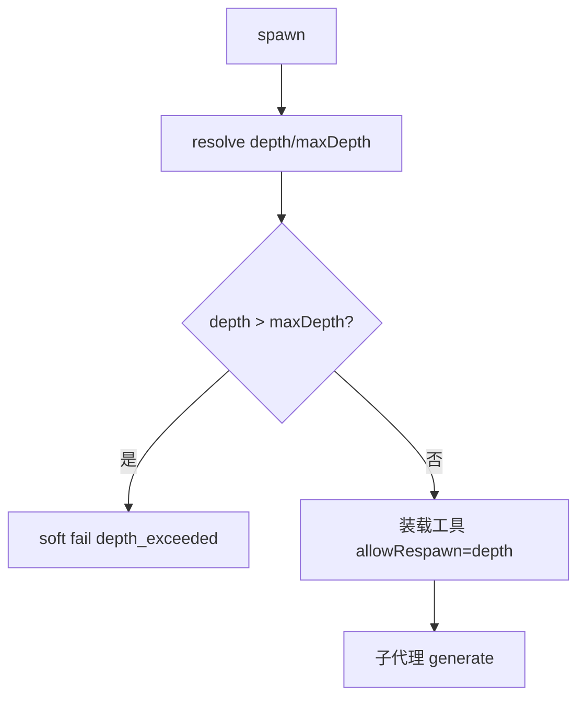

# agent-subagent-depth-limit design

## 0. 术语约定

| 术语 | 定义 | 防冲突结论 |
|------|------|-----------|
| depth | 本次 spawn 创建的子代理深度，主助手首次为 0 | 契约 4.4 |
| maxDepth | 允许的最大 depth，默认 1，硬上限 2 | 契约锁定 ≤2 |
| 再委派 | 子代理内再次调用 spawn_research_subagent | 仅当 depth < maxDepth 时装载该工具 |

## 1. 决策与约束

**默认**：maxDepth=1；ctx 带 `spawnDepth`/`spawnMaxDepth`；越界返回 `errorCode=subagent_depth_exceeded`（不抛崩）；step 前缀 `spawn_research_subagent` 或 `spawn_research_subagent/d{n}`。

**不做**：写子代理；并行 fanout；改 maxSteps/超时默认。

## 2. 名词与编排

输入增量 depth/maxDepth；`resolveSpawnDepth`；`filterSubagentToolNames({ allowRespawn })`。

## 3. 验收

1. 默认主助手 spawn depth=0 成功  
2. depth=0 子代理可再 spawn（maxDepth=1）  
3. depth=1 子代理不再暴露 spawn 工具  
4. 显式 depth>maxDepth → soft fail  
5. maxDepth 入参 >2 被夹到 2  

## 4. 架构

更新 runtime-assistant 子代理一句。
