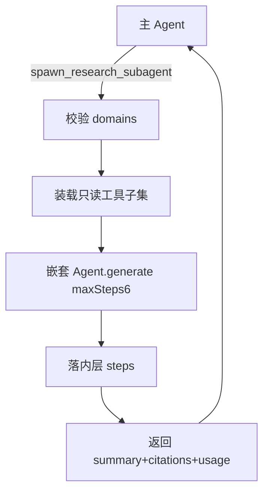

# agent-subagents design

## 0. 术语约定

| 术语 | 定义 | 防冲突 |
|------|------|--------|
| spawn_research_subagent | system 域只读委派工具（契约 4.10 锁名） | 非子代理自身可再调用 |
| 子代理 | 嵌套 Mastra Agent，工具子集仅 knowledge/doc_library/system（剔除委派自身与写工具） | 确认协议只在主对话 |

## 1. 决策与约束

**需求**：跨库/复杂检索时主 Agent 可派生子代理独立跑多步只读工具，汇总结论与引用。

**倾向**：

1. 工具挂 `system` 域；意图含 system/knowledge/doc_library 时可用（默认只读三域已含 system）。
2. 子代理 `maxSteps=6`；整体超时 90s；内层工具走韧性包装。
3. 内层 step 名 `spawn_research_subagent/<tool>` 写入同一 run。
4. 壳沿用既有 `subAgentUsage` metadata（若主流程可写）+ 工具结果卡片即可；不新开 HTTP。

**不做**：团队 DSL；子代理写/危险；子代理再 spawn；改 `/api/agent/**`。

## 2. 名词与编排

### 2.1 名词

**现状**：无委派工具；壳有 `subAgentUsage` 展示位。

**变化**：`tools/research-subagent.ts` 注册 `spawn_research_subagent`；输入/输出对齐契约 4.10。

### 2.2 编排

### 2.3 挂载点

1. 工具注册  
2. system 提示委派纪律  
3. （可选）工具 UI 卡片  

### 2.4 推进

1. 实现 + 单测 → 2. 注册/提示 → 3. 架构回写  

### 2.5 结构

新文件 `research-subagent.ts`；不重组目录。

## 3. 验收

1. 主 Agent 可调用 spawn，返回 ok+summary。  
2. domains 含 content_write/admin → 拒绝或剔除。  
3. 子代理工具集无 spawn / dangerous / content_write。  
4. 超时/失败 → ok=false + errorCode，主对话可继续。  
5. 内层 step 带前缀落库。  

反向：无团队 DSL；不改 `/api/agent/**`。

## 4. 架构

更新 `runtime-assistant.md` 子代理一句。
