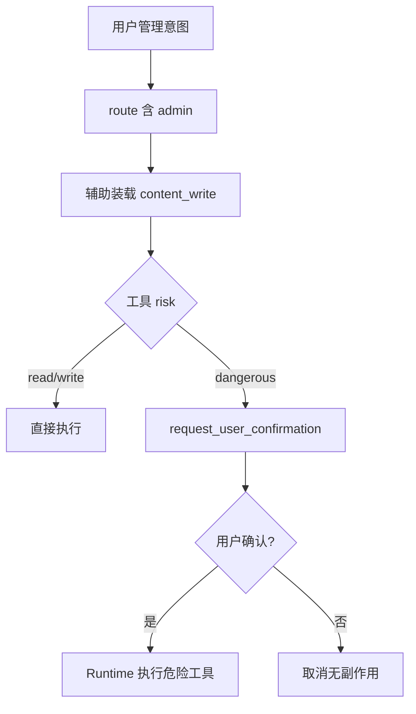

# agent-tools-admin design

## 0. 术语约定

| 术语 | 定义 | 防冲突结论 |
|------|------|-----------|
| admin 域 | `AgentDomainId="admin"` 的工具包 | 意图路由已有关键词；本条首次注册工具 |
| 公开问答开关 | 站点 `petrichor_site_appearance.public_qa_enabled` | 公开 `/ask` 页已下线，开关仍控制站点级公开问答能力；改写需**超级管理员** |
| 确认辅助域 | 命中 `admin` 时一并装载 `content_write`，以拿到 `request_user_confirmation` | 承接 confirm-write design 约定；不复制确认工具 |

## 1. 决策与约束

**需求摘要**：对话里能查/管自己的 AI 配置与 Agent API Key，超级管理员能开关公开问答；危险操作走既有确认卡。

**复杂度档位**：默认 Web 后端；危险名映射进既有 `DANGEROUS_TOOL_WHITELIST`。

**本稿默认倾向**：

1. **一期工具最小集**：

| name | risk | 白名单 | 行为 |
|------|------|--------|------|
| `list_ai_configs` | read | — | 当前用户 AI 配置列表（脱敏，不含明文 Key） |
| `list_agent_api_keys` | read | — | 当前用户未吊销的 Agent Key（前缀/名/scopes） |
| `get_public_qa_setting` | read | — | 读 `publicQaEnabled`（任意登录用户可读） |
| `set_default_ai_config` | write | — | 设某配置为默认 |
| `delete_ai_config` | dangerous | `ai_config.delete` | 删除自有配置 |
| `update_ai_config_credentials` | dangerous | `ai_config.update_credentials` | 更新自有配置的 API Key（及可选启用态） |
| `revoke_agent_api_key` | dangerous | `agent_api_key.revoke` | 吊销自有 Key |
| `set_public_qa_enabled` | dangerous* | `public_qa.disable`（仅关） | 超管改开关；**关闭**必须确认；**开启**可同工具但 risk 在实现上仍走确认（简化：一律确认） |

\* 简化：`set_public_qa_enabled` 一律 `dangerous` + 确认，避免开关分叉。

2. **路由**：`admin` 命中时辅助加入 `content_write`（若尚未有），以便确认工具可用；不因此加入 knowledge/doc_library。
3. **权限**：AI 配置 / Agent Key = `ctx.userId` 归属；公开问答写 = `isSuperAdmin`，非超管调用返回明确错误、无副作用。
4. **不做**：创建 AI 配置、创建 Agent Key（需一次性明文展示，留管理页）、改 baseUrl/model 全量编辑、配额、非超管改站点开关。

**明确不做**：新建确认表；改 `/api/agent/**`；复活公开 `/ask` 页；admin 工具进只读默认域。

## 2. 名词与编排

### 2.1 名词层

**现状**：`admin` 域空；确认白名单已含 `ai_config.*` / `agent_api_key.revoke` / `public_qa.disable` 但无工具映射；`request_user_confirmation` 在 `content_write`。

**变化**：新增 `tools/admin.ts`；扩展 `DANGEROUS_TOOL_WHITELIST` 映射；意图路由 `withContentWriteAuxiliaryForAdmin`。

### 2.2 编排层

### 2.3 挂载点

1. `admin` 工具注册  
2. 危险白名单映射扩展  
3. 意图路由：admin → 补 content_write  
4. 系统提示 admin 纪律  

### 2.4 推进策略

1. 路由辅助域 + 提示 → 2. admin 读/写工具 → 3. 危险工具 + 白名单 → 4. 单测与架构回写  

### 2.5 结构健康度

新文件 `tools/admin.ts`；确认逻辑只扩映射表。不做目录重组。

## 3. 验收契约

1. 「我有哪些模型配置」→ `list_ai_configs`，无 Key 明文。  
2. 「吊销某个 Agent Key」→ 确认卡 → 确认后吊销。  
3. 「删除 AI 配置」→ 确认后删除；取消则仍在。  
4. 非超管「关闭公开问答」→ 错误，无库变更。  
5. 超管关闭公开问答 → 确认后 `publicQaEnabled=false`。  
6. 纯问答意图不装载 admin 工具。  

反向：无创建 Key/配置工具；不改 `/api/agent/**`；不默认装载 admin。

## 4. 架构

更新 `runtime-assistant.md`（admin 域 + 辅助装载 content_write）。
