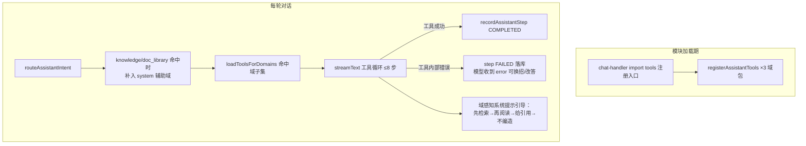

# agent-tools-readonly design

## 0. 术语约定

| 术语 | 定义 | 防冲突结论 |
|------|------|-----------|
| 锁名工具 | 契约 4.3 表锁定的 12 个工具名（`list_knowledge_bases` … `upsert_plan`），名称不可改 | 其中 6 个名字在旧栈以**内联工具**存在（mastra agent / doc chat route）——不冲突：注册表是 assistant 模块私有，旧栈工具不进注册表，两边独立运行至 legacy-retire |
| 域工具包 | 按域组织的注册单元，落 `src/server/assistant/tools/`，模块加载时调 `registerAssistantTools` | 全仓无 `tools/` 子目录于 assistant 下，无冲突 |
| 组合检索 | `search_knowledge` 内部策略：树检索为主、语义检索增强、跨库检索兜底 | 新词仅本 design 使用 |
| 系统概览 | `list_system_overview` 返回的轻量计数 + 模型就绪状态 | 与 `loadDashboardOverview`（重型热力图/趋势聚合）区分，不复用 |
| 辅助域 | 意图命中 `knowledge` / `doc_library` 时，由 `routeAssistantIntent` 同时补入 `system`，让引用、进度、计划、产物等系统域工具在检索问答中可达 | 来源为 roadmap 4.2 补丁；只补 `system`，不自动加入 `content_write` / `admin` |

## 1. 决策与约束

**需求摘要**：把契约 4.3 锁定的 12 个只读工具注册进 agent-runtime-core 建好的域注册表，并让 `/api/assistant/chat` 的系统提示域感知。成功标准（= 最小闭环的后端部分）：一个对话内能问「有多少个知识库」（`list_system_overview` 真实计数）、检索并阅读知识库内容（`search_knowledge`+`read_knowledge_node`）、检索并阅读文档库内容（`search_documents`+`read_document`），全程 step 落库。**不做前端渲染接线**（归 agent-chat-shell）。

**复杂度档位**：接口稳定性 = 高（工具名/域由契约锁定）；其余走 Web 后端默认档位。

**关键决策**：

1. **12 个锁名工具一次全注册**（含 `upsert_plan` / `save_answer_artifact`）。理由：4.3 表整体属 Tool Domains 模块的「一期锁定集」，而 roadmap 第 5 条 `agent-plan-resilience` 的主体是「计划 UI 展示 + 超时/重试策略」，不是工具注册本身。**替代方案**：`upsert_plan` 留给第 5 条——会让 4.3 锁定集在本条交付后仍不完整。→ 请拍板（见下方「待拍板」）。
2. **`search_knowledge` = 组合检索**：有 `knowledgeBaseId`（或 focus 提供）→ 树检索 `retrieveTreeNodesForAgent` 为主，语义 `semanticSearchTreeNodes` 增强；无库范围 → 跨库 `searchWikiPagesAcrossKbs`。语义检索不可用（sqlite / 无 EMBEDDING 配置）时**静默降级**为纯关键词，不抛错。
3. **`read_knowledge_node` 统一寻址**：`nodeKey | pageKey | articleId` 三选一，内部分发到现有三个 reader（树节点 / Wiki 页 / 源文章）。
4. **`list_system_overview` 新写轻量查询**，不复用 `loadDashboardOverview`（后者做 90 天热力图/趋势，重且慢）。内容：知识库数、文章数、文档库数、文档数、assistant 对话数、CHAT / EMBEDDING 默认配置是否就绪。
5. **UI 工具无副作用回显**：`show_progress` / `show_citations` / `show_data_table` / `upsert_plan` 输出对齐现有 tool-ui 组件 schema；`upsert_plan` 本条仅输出 Plan 形状（同 id 重复调用即"更新"），持久化与展示归 plan-resilience。
6. **risk 赋值**：纯查询与 UI 回显 = `read`；`save_answer_artifact` = `write`（它插入 `petrichor_assistant_artifact` 行，按 4.4「risk=read 禁止写副作用」必须标 write；4.3 只锁名称与域，除 show_progress 外未锁 risk）。
7. **系统提示域感知**：替换 chat-handler 里「尚未接入任何站内工具」句，按本轮装载的域生成提示段（含引用规则、检索优先级、不编造）。
8. **只读辅助域在意图路由集中补齐**：`routeAssistantIntent` 产出的域集合只要含 `knowledge` 或 `doc_library`，就追加去重后的 `system`；chat-handler 不再二次加工，run 的 `intent_domains_json` 与 `loadToolsForDomains` 继续使用同一 `route.domains`。纯 system 元问题不反向追加 knowledge/doc_library，写入/管理域也不因本规则自动加入。

**已拍板（2026-07-10 用户裁决）**：

- **拍板 1（范围）**：`upsert_plan` 随本条注册。本条只输出对齐 `tool-ui/plan` 的 Plan 形状；持久化、展示、韧性策略仍归 `agent-plan-resilience`。
- **拍板 2（假设 C）**：Plan.status 以现有组件为准用 `"completed"`。契约 4.7 字面 `"done"` 判定为笔误，已走 `cs-roadmap update` 做单词级修正并记变更日志；**不改 plan 组件**去迁就旧字面。

**明确不做**（可反向核对）：

- 不注册 `propose_wiki_patch`（一期禁令，grep 反查）
- 不注册任何 `content_write` / `admin` 域工具（grep `domain: "content_write"` / `"admin"` 零命中）
- 不移植 `deep_research_kbs` 子代理工具（子代理属二期）
- 不做前端：tool-ui 渲染接线、对话界面零改动（`client-app.tsx` / `dashboard-routes.ts` / `src/components/**` 零 diff）
- 不改注册表 / 意图路由 / thread API 的契约形状；`intent-router.ts` 仅实现 roadmap 4.2 的辅助域合并；不新增 HTTP 路由；不新增表
- 不改 `/api/agent/**`、不动两条旧 chat 路由与知识库/文档库手动 CRUD

## 2. 名词与编排

### 2.1 名词层

**现状**：
- 注册表空集：`src/server/assistant/tool-registry.ts`（`registerAssistantTools` / `loadToolsForDomains` 就绪但无人调用）
- 被包装的现有能力（全部自带 userId 归属校验）：
  - knowledge：`listUserKnowledgeBases` / `searchWikiPagesAcrossKbs` / `searchWikiPagesForAgent` / `readWikiPageForAgent` / `readSourceArticleForAgent`（`server/kb/wiki-agent-logic.ts`）；`retrieveTreeNodesForAgent` / `semanticSearchTreeNodes` / `readTreeNodeForAgent`（`server/kb/wiki-tree.ts`）
  - doc_library：`listLibraries` / `listDocumentsForQa` / `searchChunks` / `readDocumentChunks`（`server/doc-library/library-logic.ts`）
  - UI schema 参照：doc chat route 的 plan/progress/citation/dataTable zod schema；`petrichor_assistant_artifact` 表（仅建表未使用）
- 旧栈内联同名工具继续存在于两条旧 chat 路由，与本 feature 无共享状态

**变化**（全部新增，无改名/删除）：

12 个 `AssistantToolRegistration`，名称与域按契约 4.3 原样：

| name | domain | risk | 包装 / 行为 |
|------|--------|------|------------|
| `list_knowledge_bases` | knowledge | read | `listUserKnowledgeBases` |
| `search_knowledge` | knowledge | read | 组合检索（决策 2） |
| `read_knowledge_node` | knowledge | read | 统一寻址分发（决策 3） |
| `list_doc_libraries` | doc_library | read | `listLibraries` |
| `search_documents` | doc_library | read | `searchChunks`（可传 libraryId/documentId 限定，focus 兜底） |
| `read_document` | doc_library | read | `readDocumentChunks`（fromIndex 翻页） |
| `list_system_overview` | system | read | 轻量计数 + 模型就绪（决策 4） |
| `show_progress` | system | read | UI 回显（契约标 read） |
| `show_citations` | system | read | UI 回显 |
| `show_data_table` | system | read | UI 回显 |
| `save_answer_artifact` | system | write | 插入 `petrichor_assistant_artifact`（kind/title/content_json） |
| `upsert_plan` | system | read | 输出 Plan 形状（status 用 `completed`，见拍板 2） |

**接口示例**：

```
search_knowledge
入：{ "query": "部署流程", "knowledgeBaseId": "3" }      // 省略 kb 时用 focus，再无则跨库
出：{ "mode": "tree+semantic", "hits": [{ nodeKey, title, snippet, articleId, href }] }
   语义不可用时 mode: "tree"，仍返回关键词命中
// 来源：server/kb/wiki-tree.ts retrieveTreeNodesForAgent / semanticSearchTreeNodes

read_knowledge_node
入：{ "knowledgeBaseId": "3", "nodeKey": "ch-2.1" }      // 或 pageKey / articleId，三选一
出：{ "kind": "tree_node" | "wiki_page" | "article", title, contentMd, media?, href }
// 来源：readTreeNodeForAgent / readWikiPageForAgent / readSourceArticleForAgent

list_system_overview
入：{}
出：{ knowledgeBases: 2, articles: 15, docLibraries: 1, documents: 8,
     assistantThreads: 4, chatModelReady: true, embeddingModelReady: false }
// 来源：新写轻量 count 查询 + aiModelConfigs 默认配置存在性
```

### 2.2 编排层



**现状**：chat pipeline 已就绪（见 `architecture/runtime-assistant.md`）：意图路由结果已落库，但 `loadToolsForDomains` 恒返回空集，工具循环与 step 记录从未实际运转；系统提示写死「尚未接入任何站内工具」。

**变化**：① `routeAssistantIntent` 集中补齐只读辅助域：命中 knowledge/doc_library 时把 system 加入同一结果集合，纯 system 元问题不反向扩域；② 新增注册时机——工具包在模块加载时自注册，chat-handler 以 side-effect import 挂上；③ 系统提示按本轮装载域生成；④ 工具循环、step 落库、duration 计时首次被真实触发（其余接线沿用 runtime-core）。

**流程级约束**：

- **工具错误不打断 run**：工具内部异常由 AI SDK 捕获为 error 输出 → step FAILED 落库，流继续，模型可降级作答；不向客户端抛 5xx。
- **降级语义**：`search_knowledge` 的语义支路失败（sqlite / 无 EMBEDDING 配置 / embedding 服务错误）→ 静默回退关键词结果并在输出标 `mode`，禁止整工具失败。
- **上下文体积**：读取类工具沿用现有 `maxContentChars` / `limit` 上限（树节点 1600 字符、read_document ≤40 chunk 等），防长文灌爆上下文。
- **归属安全**：所有包装函数继续走内部 userId 校验，工具层不新开越权口子；`ctx.focus` 只作默认范围，不放宽权限。
- **域集合一致**：辅助域在 intent-router 内一次补齐；run 的 `intent_domains_json` 与 `loadToolsForDomains` 均直接使用同一 `route.domains`，chat-handler 不另行追加。
- **可观测**：每次工具调用一条 step（tool_name ∈ 锁定表、input/output/duration_ms）。

### 2.3 挂载点清单

1. 域工具注册表条目：12 个锁名工具（`src/server/assistant/tools/` 各域包经 `registerAssistantTools` 注册）— 新增
2. 注册入口接线：chat-handler 对 tools 注册模块的 side-effect import — 新增
3. 系统提示：chat-handler 内提示常量由「无工具」改为域感知生成 — 修改
4. 辅助域合并：intent-router 在 knowledge/doc_library 命中时补入 system — 修改

删 1+2、还原 3+4，feature 即完全消失。无新表、无新路由、无前端注入点。

### 2.4 推进策略

1. system 域工具包：`list_system_overview`（轻量查询）+ 4 个 UI 回显 + `save_answer_artifact` → 退出：单测通过（计数正确、artifact 落行、Plan schema 对齐组件）
2. knowledge 域工具包：3 个工具含组合检索与统一寻址 → 退出：单测 + 真实 KB 手测（含语义降级路径）
3. doc_library 域工具包：3 个工具 → 退出：真实文档库手测命中片段与翻页
4. 接线与提示：intent-router 辅助域合并 + 注册入口 import + 域感知系统提示 → 退出：路由单测覆盖 focus knowledge/doc_library 均附带 system、纯 system 不扩域；e2e 对话问「有多少个知识库」调用 `list_system_overview`，focus 知识问答可调用 `show_citations`
5. 场景与错误路径收尾 → 退出：第 3 节场景全部有证据、反向核对项零命中

### 2.5 结构健康度与微重构

compound/ 目录仍不存在，无 convention 可查。

##### 评估
- 文件级 — `src/server/assistant/chat-handler.ts`（188 行）：本次仅替换提示常量 + 增加一个 import，单一职责未变，健康。
- 文件级 — `src/server/assistant/intent-router.ts`：仅在返回前集中补齐 system 辅助域，不改签名/打分/域枚举；`tool-registry.ts` 零改动。
- 目录级 — `src/server/assistant/`：现有 10 个同层文件（含 3 个 test），已达摊平阈值下限；本次要新增约 4-6 个文件。**新文件全部收进新建子目录 `src/server/assistant/tools/`**（按域分文件 + 注册入口），不再往根目录摊。

##### 结论：不做
本次不做微重构：现有文件不搬（无行为外改动），新增文件以新建 `tools/` 子目录承接——属新增文件的归属选择，非「重组目录」（零文件移动）。

##### 超出范围的观察
- `src/server/assistant/` 根目录 10 个文件已到临界，若后续 feature（confirm-write / tools-admin）继续加工具外的新面，建议届时评估把 `*-logic` / `*-handlers` 分组收纳——本条不动。

## 3. 验收契约

**关键场景清单**：

| # | 输入 / 触发 | 期望可观察结果 |
|---|------------|---------------|
| 1 | 对话问「我有多少个知识库」 | 模型调用 `list_system_overview`；回答含真实计数；step 落库（tool_name/duration_ms/COMPLETED） |
| 2 | 带 focus.knowledgeBaseId 问库内内容 | 路由 domains 含 knowledge+system；`search_knowledge`（省参用 focus）→ `read_knowledge_node` → 回答基于真实内容并给出引用（`show_citations` 输出 href 指向 dashboard 路径） |
| 3 | 无 focus 跨库问知识内容 | `search_knowledge` 跨库模式，命中带知识库归属 |
| 4 | 问文档库文件内容 | `search_documents` 命中片段 → `read_document` 可翻页续读 → 回答含定位 |
| 5 | `list_knowledge_bases` / `list_doc_libraries` | 仅返回当前用户的库（另一用户数据不可见） |
| 6 | 模型调用 `save_answer_artifact` | `petrichor_assistant_artifact` 落行（kind/title/content_json/thread_id/run_id） |
| 7 | 模型调用 `upsert_plan` | 输出 Plan：todos[].status ∈ pending/in_progress/completed/cancelled（对齐组件） |
| 8 | sqlite 或无 EMBEDDING 配置下检索 | `search_knowledge` 返回关键词命中且 mode 标注降级，不报错 |
| 9 | 工具入参指向不存在实体（如 read_document 传假 id） | step FAILED 落库；SSE 流不中断；模型继续作答 |
| 10 | 问知识库问题时查 run 记录 | `intent_domains_json` 含 knowledge+system；该 run 所有 step.tool_name 属该域集合的锁定工具，且装载使用同一集合 |

**明确不做的反向核对项**：

- `grep -r propose_wiki_patch src/server/assistant` 零命中
- 注册工具名集合与契约 4.3 表**恰好相等**（12 个，不多不少——可由注册表单测断言）
- `grep -rn 'domain: "content_write"\|domain: "admin"' src/server/assistant` 零命中
- `git diff` 不含 `app/api/agent/`、两条旧 chat 路由、`src/components/**`、`client-app.tsx`、`dashboard-routes.ts`
- 无新增 `app/api/**` 路由目录、schema.ts / full-migration.ts 零 diff

## 4. 与项目级架构文档的关系

验收时更新 `architecture/runtime-assistant.md`：「结构与交互」的域工具注册表段从「尚未注册任何业务工具」改为 12 工具清单 + 降级/体积/归属约束；`ARCHITECTURE.md` 索引一句话同步（运行时 → 可查系统/检索两库）。无新子系统 doc。
