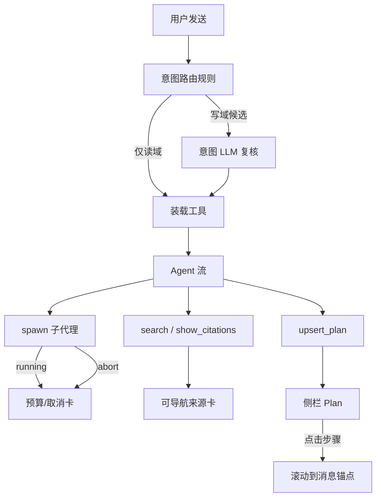

# assistant-runtime-polish design

## 0. 术语约定

| 术语 | 定义 | 防冲突 |
|---|---|---|
| **domains / 工具域** | `AgentDomainId`，决定本轮装载哪些工具 | 与引用条目里的 `domain`（来源标签/站名）**不是**同一概念；文中写「工具域」或「引用域」 |
| **写域** | `content_write` / `admin`（含危险确认相关装载面） | — |
| **spawn / 子代理** | `spawn_research_subagent` / `spawn_research_fanout` / `spawn_write_subagent` | — |
| **取消（abort）** | 中止进行中的子代理 / fanout 任务 | 与确认卡「取消」、Plan todo `cancelled` **三分开** |
| **预算** | 子代理已知上限：`maxSteps` / 超时 / `maxDepth` / fanout `tasks≤3`，及运行中 `usage` | 本 feature 做可视化，不重定契约数字（除非验收需要微调） |
| **citations / 引用** | `show_citations` 工具产出 + CitationList | spawn 返回的 `citations[]` 须接到同一引用体验 |
| **Plan 轨** | `upsert_plan` 持久计划（库表 + 侧栏） | 与 `show_progress` **进度轨**区分；侧栏可同时展示，但来源标签要可辨 |
| **Tool UI** | `makeAssistantToolUI` 注册的消息内卡片 | 与 `components/tool-ui/*` 组件库分层 |

## 1. 决策与约束

### 需求摘要

- **做什么**：在现有 chat-first Assistant 上增强四块体验——（1）少误挂写域；（2）子代理运行中可见预算并可取消；（3）检索结果与引用可导航、体验统一；（4）Plan 侧栏与消息锚点双向更清晰。
- **为谁**：已登录、在 `/dashboard/assistant` 连续多轮办事的用户。
- **成功标准**：
  - 纯问答/检索类话术在无明确写意图时，本轮**不装载** `content_write`/`admin`（或装载率可测下降，见验收）。
  - 子代理运行中 UI 能看到预算进度，并可触发 abort；取消后卡片有明确终态。
  - 知识库/文档库检索 hit 与 `show_citations`、spawn citations 均可点到站内目标（或外链）。
  - 点击侧栏 Plan 步骤可滚动到对应消息；消息侧可感知「当前计划在侧栏」。
- **明确不做**：
  - 不新开跨会话记忆、团队 DSL、公开 `/ask`、对话内建 AI 配置。
  - 不改 `/api/agent/**`；不恢复 Wiki 补丁工具。
  - 不把 dangerous 工具对模型暴露；不取消服务端确认票据。
  - 不把 Plan 重新画回消息大卡（消息内仍隐藏 `upsert_plan`/`show_progress` 大卡，侧栏为主）。

### 复杂度档位

走「站内 UX + 运行时小增强」默认档位，无偏离。

### 关键决策（含待你拍板）

1. **写域门槛（倾向 A）**  
   - **A**：命中写域规则后，**强制走意图 LLM 复核**（即使规则 confidence ≥0.5）；LLM 未确认写意图则去掉写域。  
   - **B**：只收紧写动词正则 + 提高写域权重门槛，不强制 LLM。  
   - **C**：写域与读域互斥（有写意图时仍可带 knowledge，但禁止「闲聊动词」挂写）。  
   - **假设**：用户接受「写意图略慢半拍」（多一次意图 LLM）换误挂下降。若否选 B。

2. **子代理取消（倾向 A）**  
   - **A**：Spawn Tool UI 提供「停止」→ 通过当前 chat `AbortSignal` / 工具级 abort 取消该子代理（fanout 可取消整组）。  
   - **B**：仅展示预算，取消只靠点 Composer 全局停止。  
   - **假设**：nested-agent 已支持 abort；本 feature 把 signal 从 chat 贯通到 spawn，并让 UI 可触发。

3. **检索与引用（倾向 A）**  
   - **A**：检索 hit 可导航；spawn `citations` 复用 CitationList；两套视觉对齐「来源条」。  
   - **B**：只做 spawn citations 接入，检索卡仍只读。  

4. **Plan 联动（倾向 A）**  
   - **A**：侧栏步骤 → 消息锚点滚动；消息气泡显示「计划已同步到侧栏」弱提示（非大卡）。  
   - **B**：只做侧栏→消息，不做消息侧提示。  

### 放哪儿

全部落在现有 **runtime-assistant** 子系统内：服务端 `src/server/assistant/**`，壳 `features/pages/assistant/**` + 既有 `components/tool-ui/**`。不新建子系统。

## 2. 名词与编排

### 2.1 名词层

#### 意图

- **现状**：`IntentRouteResult { domains, confidence, rationale, source }`；规则 top-2 主域 + `withAuxiliaryDomains`；UI part `data-intent-route`。  
  // 来源：`intent-router.ts` / `intent-llm.ts` / `assistant-tool-renders.tsx`
- **变化**：
  - 增加「写域候选」与「写域确认」语义（可落在 rationale/signals，不必改 HTTP）。
  - 示例：输入「这篇文章讲了什么」→ domains 仅读域；输入「帮我删掉这篇文章」→ 含 `content_write`（经复核）。

#### 子代理运行态

- **现状**：终态 `SpawnResearchResult` / fanout / write 含 `usage`、`errorCode`；UI 事后折叠卡。  
  // 来源：`research-subagent.ts` / `nested-agent.ts` / `Spawn*ToolUI`
- **变化**：
  - Tool 运行中暴露可观察中间态（或 UI 根据 status=running 展示预算上限 + 已用，若流式中间态成本高则至少 running 骨架 + 取消）。
  - 示例：running → `{ status: running, budget: { maxSteps, timeoutMs }, usage?: partial }`；abort → `{ ok:false, errorCode: "aborted" }`。

#### 可导航来源

- **现状**：`show_citations` → CitationList 可跳转；search Tool UI hit 只展示文本。  
  // 来源：`CitationToolUI` / `search-tool-ui.tsx`
- **变化**：统一「来源条」最小字段：`title` + 可选 `href` / 站内 path + 可选 `snippet`；检索 hit 与 spawn citations 都映射到它。

#### Plan 联动锚点

- **现状**：侧栏 live/persisted；消息隐藏 task tools。  
  // 来源：`AssistantTaskRail.tsx` / `AssistantChatPage.tsx`
- **变化**：步骤带 `messageId`（或 toolCallId）锚点；侧栏点击滚动；可选消息角标「侧栏计划」。

### 2.2 编排层

- **现状**：线性 pipeline：规则(+可选 LLM) → pack → stream → 各 Tool UI 终态渲染；侧栏扫消息 parts。
- **变化**：
  - 意图：写域候选强制复核支线。
  - spawn：signal 贯通 + UI 可取消。
  - 引用：检索/spawn/show_citations 汇入同一来源体验。
  - Plan：侧栏与消息锚点双向弱联动（以侧栏→消息为主）。
- **流程级约束**：
  - 取消幂等：重复 abort 安全。
  - 写域误挂下降优先于召回「可能想写」；拿不准时偏读域。
  - Plan 消息内仍不渲染大卡。
  - 可观测：意图芯片继续展示 domains；取消/失败有明确文案。

### 2.3 挂载点清单

1. **意图装载点**：`chat-handler` 最终 `domains` → `loadMastraToolsForDomains` — 修改（写域复核后的集合）
2. **意图芯片**：`data-intent-route` / `IntentRouteDataUI` — 修改（可展示「已复核写域」类 label）
3. **Spawn Tool UI**：`SpawnResearchSubagentToolUI` / Fanout / Write — 修改（预算 + 取消）
4. **检索 / 引用 UI**：`search-tool-ui` + `CitationToolUI`（及 CitationList 用法）— 修改
5. **Plan 侧栏**：`AssistantTaskRail` + 消息气泡对 task tools 的处理 — 修改（锚点联动）

本 feature **不新增** API 路由或表（若锚点只需前端 message id，不必落库）。

### 2.4 推进策略

1. **意图**：写域复核编排 + 规则收紧 → 单测覆盖「问答不挂写 / 删除挂写」  
2. **子代理**：abort 贯通 + Spawn UI 预算/取消 → 手动或测验证取消终态  
3. **引用**：检索可点 + spawn citations 接 CitationList → 页面可点跳转  
4. **Plan**：侧栏锚点滚动 + 弱提示 → 点击侧栏定位消息  
5. **联调收尾**：四条验收场景过一遍  

### 2.5 结构健康度与微重构

##### 评估
- 文件级 — `AssistantChatPage.tsx`（~1215）：已拆过模块，本 feature 主要改 rail / tool-renders / search-tool-ui，**少改主文件**。  
- 文件级 — `assistant-tool-renders.tsx`（~523）：Spawn/Citation 会改，职责仍是 Tool UI 聚合，可接受。  
- 文件级 — `intent-router.ts`（~74）：小，直接改。  
- 目录级 — `features/pages/assistant/`：已有拆分文件，本次**不要求再加 ≥2 新文件**；若 Spawn 进度卡变厚，可新建 `assistant-spawn-tool-ui.tsx`（可选）。  
- compound convention：无命中。

##### 结论：不做（默认）

原因：刚拆完壳；本 feature 改动分散在小文件，再拆收益不抵风险。若 Spawn UI 单文件暴涨 >200 行独立逻辑，implement 可顺手抽到 `assistant-spawn-tool-ui.tsx`（只搬不改行为）。

##### 超出范围的观察
- `AssistantChatPage` 仍偏大 → 后续可 `cs-refactor` 继续拆气泡，不阻塞本 feature。

## 3. 验收契约

### 关键场景

| # | 触发 | 期望 |
|---|---|---|
| N1 | 「这篇讲了什么」+ knowledge focus | 意图域无 `content_write`/`admin`；可读检索工具可用 |
| N2 | 「删掉这篇文章」 | 含 `content_write`；出现确认卡路径仍可用 |
| N3 | 触发 research 子代理后点停止 | 卡片终态为已取消/中止；不再长时间 running |
| N4 | 子代理 running | 可见预算信息（至少 maxSteps/超时或等价文案） |
| N5 | search 命中带站内路径的结果 | 点击可进入对应文章/文档 |
| N6 | spawn 返回 citations | 以引用列表呈现且可点 |
| N7 | upsert_plan 后侧栏有步骤 | 点击步骤滚动到相关消息附近 |
| E1 | 取消已结束的子代理 | 无报错风暴；幂等 |
| E2 | 意图 LLM 超时/失败且规则曾挂写域 | **降级为去掉写域**（偏安全）或保留规则结果——**假设选去掉写域**；若你要「失败则信任规则」请改 |

### 明确不做（反向核对）

- [ ] 无新记忆/团队 DSL/`/ask`/对话内建 Key  
- [ ] 消息流仍不出现 Plan 大卡  
- [ ] dangerous 仍不对模型暴露  

## 4. 与项目级架构文档的关系

落在 `.codestable/architecture/runtime-assistant.md`。implement 验收后建议 `cs-arch update` 补一句：写域复核、spawn abort UI、引用统一、Plan 锚点。本 design **不改** roadmap 契约数字（maxDepth/fanout≤3/确认协议）。
