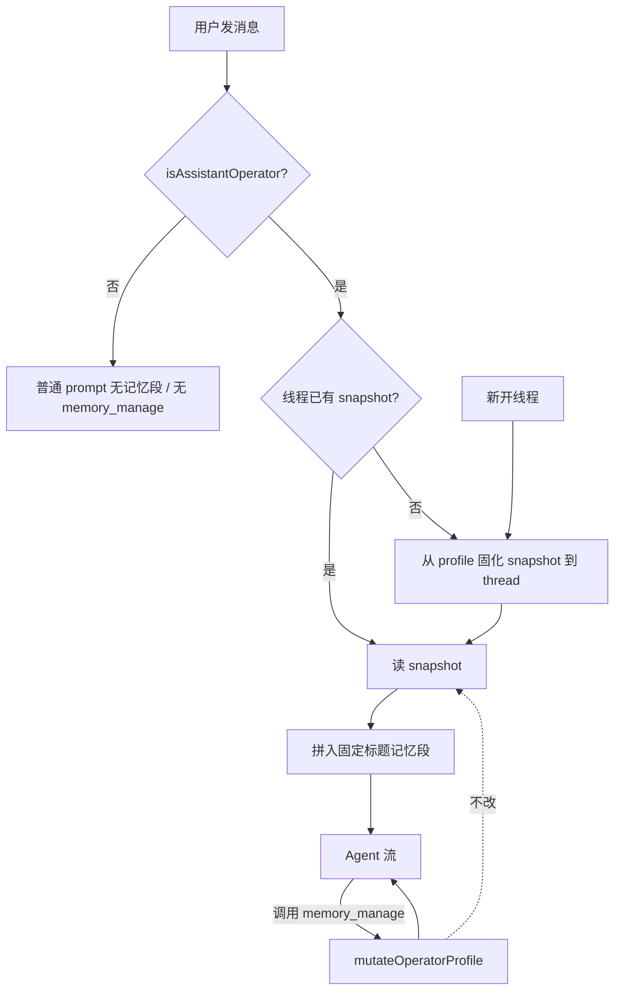

# operator-persistent-memory design

## 0. 术语约定

| 术语 | 定义 | 防冲突 |
|---|---|---|
| **操作员 / operator** | 通过 `isAssistantOperator(user)` 的登录用户；当前实现 = `isSuperAdmin` | 与业务「管理员页面」同权限来源，但本栈**禁止**散落调用 `isSuperAdmin` / `userId===1` |
| **常驻记忆 / profile** | 两块短文：`user_profile_md`（类 USER.md）+ `agent_notes_md`（类 MEMORY.md） | 与旧表 `petrichor_agent_memory`（FACT/TOPIC 蒸馏）**不是**同一套；本 feature 不读不写旧表 |
| **冻结快照 / snapshot** | 写入 `assistant_thread.operator_memory_snapshot_json` 的本线程固定副本 | 与 thread `context_summary_md`（对话摘要）分开 |
| **memory_manage** | 操作员可调用的记忆增删改工具；只改 profile，不改本线程 snapshot | 与危险确认协议无关（非 dangerous） |

## 1. 决策与约束

### 需求摘要

- **做什么**：为操作员接通 Hermes 式常驻短文记忆——门闩抽取、profile 持久化、按线程冻结注入 system 提示、`memory_manage` 可写。
- **为谁**：站内超级管理员（操作员）；非操作员无感。
- **成功标准**：
  - 操作员新开线程：instructions 含固定标题段「操作员常驻记忆（本线程冻结快照）」且内容来自当时 profile。
  - 同线程内 `memory_manage` 写入后，**本线程**提示仍为旧快照；**新线程**看到更新。
  - 非操作员：无该段、无 `memory_manage` 工具；写路径 403/`assistant_operator_only`。
  - 字数超上限拒绝写入（`memory_limit_exceeded`）。
- **明确不做**（本条 feature）：
  - 情景检索 FTS/embedding、可写 Skills、进化提案（后续 roadmap 条目）。
  - 旧记忆页 / 旧蒸馏管道 / 独立记忆 HTTP 管理页。
  - 改 `/api/agent/**`；本轮不改壳 UI（无设置抽屉；靠工具写入即可演示闭环）。
  - 周期 nudge 后台自动写记忆（仅模型主动调 `memory_manage`）。

### 复杂度档位

走「站内运行时小增强」默认档位，无偏离。

### 关键决策

1. **门闩**：唯一入口 `isAssistantOperator` / `assertAssistantOperator`（roadmap 4.0）；内部调 `isSuperAdmin`。  
2. **工具域**：`memory_manage` 挂 `domain: "system"`、`risk: "write"`；注册带 `requiresOperator: true`，装载时非操作员过滤掉（不对模型暴露）。  
3. **注入位置**：在 `buildAssistantSystemPrompt` 结果之上、上下文摘要/召回之前，拼接常驻记忆段（标题文案锁定，避免无意义抖动）。  
4. **profile 按 user_id**：每位操作员一行；多超管互不共享（与门闩 = isSuperAdmin 一致）。  
5. **假设**：本条不需要前端审批 UI；工具返回 `applied: "profile_only"` 即可让模型（及操作者）理解生效时机。

### 放哪儿

全部在现有 **runtime-assistant** 内：`apps/web/src/server/assistant/**` + `schema` / migration。不新建子系统。

## 2. 名词与编排

### 2.1 名词层

#### 操作员门闩

- **现状**：各处直接 `isSuperAdmin(systemRole, id)`。  
  // 来源：`admin/logic.ts`
- **变化**：新增  
  `isAssistantOperator(user)` / `assertAssistantOperator(user)`  
  // 建议新文件 `assistant/operator-gate.ts`  
  - 示例：`{ id:1, systemRole:"SUPER_ADMIN" }` → true；`{ id:2, systemRole:"USER" }` → false → assert 抛错映射 403 `assistant_operator_only`。

#### Profile 与 Snapshot

- **现状**：无 operator profile；thread 无 snapshot 列。  
  // 来源：`db/schema.ts` `assistantThreads`
- **变化**（对齐 roadmap 4.1）：
  - 表 `petrichor_assistant_operator_profile`：`user_id` PK、`user_profile_md`、`agent_notes_md`、`updated_at`
  - 常量：`OPERATOR_USER_PROFILE_MAX_CHARS=1375`、`OPERATOR_AGENT_NOTES_MAX_CHARS=2200`（合计 ≤3575）
  - thread 列 `operator_memory_snapshot_json`：`{ userProfileMd, agentNotesMd, frozenAt }`
  - 函数：
    - `loadOperatorMemoryPromptSection(user, threadId): Promise<string | null>`  
      （相对 roadmap 签名补上 `user` 以过门闩；非操作员 → null）
    - `mutateOperatorProfile(user, patch): Promise<{ok:true}|{ok:false,errorCode}>`

#### 工具注册扩展

- **现状**：`AssistantToolRegistration` 仅 domain/risk/…；`loadMastraToolsForDomains` 按 domain 过滤。  
  // 来源：`domain-types.ts` / `tool-registry.ts`
- **变化**：
  - 可选字段 `requiresOperator?: boolean`
  - `loadMastraToolsForDomains(domains, ctx, resilience, { isOperator })`：`requiresOperator && !isOperator` 则跳过
  - `AssistantToolContext` 增加 `systemRole`（或等价字段），供工具内二次 assert

#### memory_manage

- **现状**：无。
- **变化**：新工具，输入/输出对齐 roadmap 4.1。  
  - 示例：`{ action:"add", target:"user_profile", text:"偏好用简洁中文" }` → `{ ok:true, userProfileChars:n, agentNotesChars:m, applied:"profile_only" }`  
  - 超限 → `{ ok:false, errorCode:"memory_limit_exceeded" }`  
  - replace/remove 子串未命中 → `{ ok:false, errorCode:"invalid_patch" }`

### 2.2 编排层

- **现状**：`chat-handler` → `buildAssistantSystemPrompt` → `buildInstructionsWithContextSummary`（摘要+召回）→ Agent。工具按 `toolDomains` 装载。  
  // 来源：`chat-handler.ts`
- **变化**：
  1. 构造 `isOperator = isAssistantOperator(user)`，传入工具装载。
  2. 操作员路径调用 `loadOperatorMemoryPromptSection`，把返回段接到 system 指令前部（标题锁定）。
  3. 注册并（仅操作员）装载 `memory_manage`。
- **流程级约束**：
  - 快照只在「本线程首次需要注入且列为空」时写入；之后只读。
  - `mutateOperatorProfile` 永不改写当前 thread snapshot。
  - 错误码：`assistant_operator_only` | `memory_limit_exceeded` | `invalid_patch`（与 roadmap 4.5 一致）。
  - 幂等：同一 snapshot 重复 load 不重新从 profile 覆盖。

### 2.3 挂载点清单

1. **Schema**：`petrichor_assistant_operator_profile` 新表 + `petrichor_assistant_thread.operator_memory_snapshot_json` — 新增  
2. **迁移 SQL**：`docs/migrations/` 增量脚本 — 新增  
3. **工具注册**：`memory_manage` 进入 assistant 工具 registry — 新增  
4. **Chat 编排**：`/api/assistant/chat` 装载链注入记忆段 + operator 过滤 — 修改  

（无新 HTTP 路由、无新前端菜单。）

### 2.4 推进策略

1. **门闩 + 常量/类型**：`operator-gate` 与 profile/snapshot 类型、字数校验纯函数  
   退出：单测覆盖 operator true/false、字数边界  
2. **持久化**：表/列 + `load`（含首次冻结）/`mutate`  
   退出：单测或集成测：写 profile → 新 thread load 见新内容；同 thread 再见旧快照  
3. **工具**：`memory_manage` + registry `requiresOperator` 过滤  
   退出：非 operator 装载集无此工具；operator 调用 add/replace/remove 行为符合契约  
4. **编排接通**：`chat-handler` 注入 + 传 `isOperator`  
   退出：定向测或手工：操作员首轮 instructions 含锁定标题段  
5. **范围守护**：确认未碰旧 memory 表、无新 UI、无 episodic/skills  
   退出：grep / 验收清单勾选  

### 2.5 结构健康度与微重构

##### 评估

- 文件级 — `chat-handler.ts`（~508 行）：编排已偏满，但本 feature 只加少量调用点（门闩、load 段、装载选项），不在此文件堆业务逻辑。  
- 文件级 — `schema.ts`（~960 行）：仓库惯例集中 schema，本次加表/列属常规，不拆。  
- 文件级 — `tool-registry.ts` / `system-prompt`：小改。  
- 目录级 — `server/assistant/`（已较多同层文件）与 `tools/`（~21）：本次新增 `operator-gate.ts`、`operator-memory.ts`（或同类）、`tools/memory-manage.ts` 共约 2–3 个文件；未达「再加 ≥2 且已摊平需重组」的强制线，且命名可按 `operator-*` 前缀成组。  
- compound convention：未命中强制目录规约。

##### 结论：不做微重构

原因：改动以新文件承载计算；对胖文件只做薄挂载；目录重组收益不抵风险。

##### 超出范围的观察

- `assistant/` 根目录文件继续增多 → 后续可 `cs-refactor` 按 operator / context / tools 分子目录，不阻塞本 feature。

## 3. 验收契约

### 关键场景

| # | 触发 | 期望 |
|---|---|---|
| 1 | 操作员、空 profile、新线程首轮 chat | instructions 含「操作员常驻记忆（本线程冻结快照）」；两块可为空但仍有结构/标题；thread 写入 snapshot |
| 2 | 操作员 `memory_manage` add 后**同一线程**再问 | 提示记忆段仍为旧快照；profile 表已更新 |
| 3 | 场景 2 后**新开线程**首轮 | 记忆段为更新后内容；新 snapshot |
| 4 | 非操作员 chat | 无记忆段；工具列表无 `memory_manage` |
| 5 | 写入导致超 `1375`/`2200` 或合计超限 | `ok:false, errorCode:memory_limit_exceeded`；库内容不变 |
| 6 | replace/remove 的 `old_text` 不存在 | `ok:false, errorCode:invalid_patch` |
| 7 | 非操作员若直调 mutate（单测） | `assistant_operator_only` |

### 明确不做（反向核对）

- [ ] 无 `search_operator_history` / `skill_manage` / evolution API  
- [ ] 不读写 `petrichor_agent_memory*`  
- [ ] 无新记忆管理页 / 无本 feature 壳 UI  
- [ ] 业务代码无 `userId===1` 充当本栈门闩；无散落 `isSuperAdmin` 替代 `isAssistantOperator`

## 4. 与项目级架构文档的关系

落地后由 acceptance 回写 `architecture/runtime-assistant.md`：补充操作员常驻记忆与冻结快照、门闩入口。本 design 不直接改 arch。

硬约束来源：`roadmap/assistant-operator-memory-evolution` 第 4.0 / 4.1 / 4.5 节。
