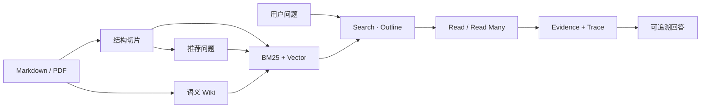
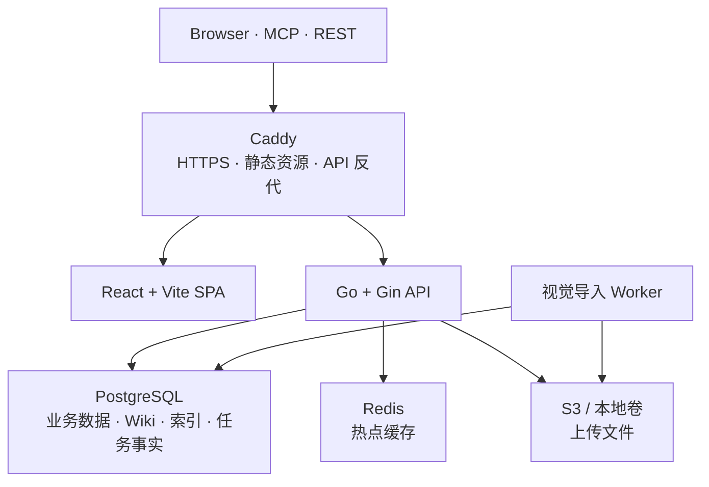

<div align="center">


# Petrichor

### 让知识被人读懂，也被 AI Agent 正确调用

**开源、自托管的知识平台：用 Markdown 写作，把内容编译成语义 Wiki，\
再通过 Agentic RAG 生成可追溯的回答。**

*A self-hosted knowledge platform that turns Markdown into wikis, evidence and agent-ready knowledge.*

[](https://github.com/Ciao1019/Petrichor/actions/workflows/ci.yml)
[](LICENSE)
[](https://go.dev)
[](https://bun.sh)
[](https://react.dev)
[](https://www.postgresql.org/)

[**产品介绍**](https://wl.do/petrichor) · [**在线体验**](https://wl.do) · [**快速开始**](#-快速开始) · [**文档中心**](docs/README.md) · [**GitHub Wiki**](https://github.com/Ciao1019/Petrichor/wiki)

</div>

---

## ✨ 为什么是 Petrichor

- **知识不是一次性向量。** 原文分片、推荐问题、语义 Wiki 和文章目录并存，分别处理事实、用户问法、概念关系与结构性问题。
- **检索和阅读严格分离。** Agent 先用 Search / Outline 定位，再 Read 原文形成 Evidence，避免把一批相似片段无差别塞进上下文。
- **Wiki 是可维护的知识中间层。** 从整篇文档抽取实体、概念和关系，让多篇文章聚合到同一页面，同时保留来源引用与新鲜度指纹。
- **知识可以交给其它 Agent。** 除 REST 和 MCP 外，还能导出 OKF、Obsidian 与可安装的 Agent Skill 包。
- **运行边界完全可控。** Web、API、Worker、PostgreSQL、Redis 和对象存储均由部署者管理，模型供应商可按用途自由配置。

## 🧩 核心能力

- **结构化写作** — PlateJS、Markdown、代码块、公式、表格、白板、思维导图与媒体嵌入。
- **知识库与发布** — 多级目录、标签、全文搜索、文章分享、RSS / Atom 与公开问答。
- **Agentic RAG** — 标题感知切片、推荐问题、BM25 / Vector / Wiki 融合、目录导航、Evidence / Trace。
- **语义 Wiki** — 实体与概念抽取、多文章聚合、关系图谱、来源引用、补丁审计与结构检查。
- **Agent Runtime** — ReAct 工具循环、计划、子 Agent、动态 Skill、预算控制和外部研究。
- **开放集成** — API Key、MCP、REST、知识 Skill 包、能力清单与完整调用审计。
- **自托管基础设施** — Go + Gin、Goose、Sa-Token-Go、PostgreSQL、Redis、S3 兼容存储和 Caddy。

## 🚀 快速开始

### Docker Compose 部署

准备 Docker Engine、Compose v2，以及一套可从容器访问、已启用 `pg_trgm` 与 `vector`（pgvector）扩展的 **PostgreSQL 16+** 数据库：

```bash
git clone https://github.com/Ciao1019/Petrichor.git
cd Petrichor

cp .env.example .env
cp apps/api/config.example.toml apps/api/config.toml
```

启动前至少完成以下配置：

1. 在 `.env` 中设置 `PETRICHOR_DOMAIN`；本机 HTTP 可保持 `:80`。
2. 在 `apps/api/config.toml` 中填写 `[database].url`。
3. 为 `[encryption]` 生成稳定的随机 `key` 和 `salt`。
4. 在 `[storage]` 中选择 `/data/uploads`，或配置 `[storage.s3]`。
5. 按需配置登录、AI 模型供应商和外部搜索能力。

```bash
docker compose up -d --build
docker compose ps
docker compose logs -f api worker
```

打开配置的域名，首次访问会进入管理员初始化页。Petrichor 不写入默认账号，初始化只能成功执行一次。

> [!IMPORTANT]
> `compose.yaml` 不内置 PostgreSQL，请连接本地、自建或托管的 PostgreSQL 实例，并确认可以创建 `pg_trgm` 与 `vector` 扩展。不要把数据库连接串、Cookie、Token、API Key 或真实 `config.toml` 提交到仓库。

<details>
<summary><strong>本地开发</strong></summary>

<br />

前置要求：Bun 1.3.14+、Go（版本以 `apps/api/go.mod` 为准）、Docker，以及启用 pgvector 的 PostgreSQL 16+。

```bash
bun install --cwd apps/web
cp apps/web/.env.example apps/web/.env.local
cp apps/api/config.example.toml apps/api/config.toml

docker compose up -d redis
```

将 `config.toml` 的 `cache.redis.url` 改为 `redis://127.0.0.1:6379/0`，然后分别启动：

```bash
# 终端 1：Go API，默认 http://127.0.0.1:8080
cd apps/api && go run ./cmd/server

# 终端 2：视觉导入 Worker
cd apps/api && go run ./cmd/worker

# 终端 3：Bun / Vite Web，默认 http://127.0.0.1:3000
bun dev
```

</details>

## 🧠 Agentic RAG



`knowledge.search` 只返回轻量定位信息。Agent 必须通过 `knowledge.read` / `read_many` 深读，正文才会成为 Evidence；推荐问题命中后也必须回到原始分片。结构性问题则通过 `knowledge.outline` 浏览 PageIndex 或标题目录，不让相似度检索打乱章节顺序。

完整的切片参数、Wiki 构建、索引结构、召回算法与降级策略见
[《Petrichor Agentic RAG：从 Markdown 到可追溯回答》](docs/agent/rag.md)。

## 🏗️ 系统架构



- **Web**：`apps/web` 是 React + Vite + TypeScript SPA；Bun 负责依赖、测试和构建，生产静态资源由 Caddy 提供。
- **API**：`apps/api` 是 Go + Gin 服务，负责认证、数据库、对象存储、Agent Runtime 和知识构建；监听前自动执行 Goose 迁移。
- **Worker**：`apps/api/cmd/worker` 只处理视觉文档导入，以 PostgreSQL 任务表为事实来源，支持租约、心跳、重试和死信。
- **缓存**：Redis 只保存热点缓存；Redis 重启不会丢失视觉导入任务或已提交的知识数据。
- **入口**：生产环境只公开 Caddy，API、Worker 与 Redis 均位于 Compose 内部网络。

> [!NOTE]
> 知识构建使用 API 进程内的有界队列，当前生产环境应保持单 API 副本。API 重启会丢失排队或执行中的知识构建，但不会影响已经提交的文章、分片、Wiki 页面和向量。

## 📚 文档导航

### 从这里开始

- [文档中心](docs/README.md) — 按目标组织的完整索引与系统概览。
- [运维手册](docs/operations.md) — Compose、探针、Worker、指标、备份与发布检查。
- [AI 模型配置](docs/ai-model-setup.md) — 供应商、用途绑定、协议和向量维度。

### 理解 Agent 与知识系统

- [Agentic RAG](docs/agent/rag.md) — 数据进入、结构切片、Wiki 编译、混合召回和深读。
- [Agent Runtime](docs/agent/runtime.md) — ReAct、状态、预算、Evidence、Trace、SSE 与安全边界。
- [知识可移植性](docs/knowledge-portability.md) — OKF、Obsidian、Agent Skill 包、编译说明书和新鲜度。

### 接入其它工具

- [外部客户端接入](docs/agent/clients.md) — Claude Code、Codex、Cursor 的 MCP / Skill 配置。
- [GitHub Wiki](https://github.com/Ciao1019/Petrichor/wiki) — 面向使用者的精选指南。

仓库内 `docs/` 是可评审、可版本化的文档事实来源；GitHub Wiki 提供精选阅读入口。

## ⚙️ 配置边界

Go 后端只读取 `apps/api/config.toml`；Web 公开变量只写入 `apps/web/.env.local`：

| 配置位置 | 负责内容 |
| :--- | :--- |
| `apps/api/config.toml` | PostgreSQL、Session、加密、S3、LinuxDo、Redis、Agent 与模型凭证 |
| `apps/web/.env.local` | `PETRICHOR_PUBLIC_*`、`VITE_*` 与本地 Go API 代理地址 |
| 根目录 `.env` | Compose 域名、公开端口、Redis 本机端口与 Go 模块代理 |

生产镜像由 Caddy 直接提供 Vite 构建产物，不运行 Bun Server。`config.toml` 通过 Compose secret 挂载，不会进入镜像。

## 🛠️ 常用命令

```bash
bun dev                 # 启动 Bun / Vite Web
bun run typecheck       # TypeScript 类型检查
bun run lint            # ESLint
bun run test            # Vitest
bun run test:coverage   # 覆盖率棘轮
bun run build           # Vite 生产构建 + Brotli / Gzip 预压缩
bun run check:bundle    # 首屏与 chunk 传输体积预算
bun run test:api        # Go 测试
bun run build:api       # Go 构建
bun run check:size      # 单文件行数约束

docker compose up -d --build
docker compose run --rm api migrate status
```

完整 Go 检查：

```bash
cd apps/api
go test ./...
go test -race ./...
go vet ./...
go run golang.org/x/vuln/cmd/govulncheck@latest ./...
```

<details>
<summary><strong>项目结构</strong></summary>

```text
.
├── apps/
│   ├── api/
│   │   ├── cmd/server/             # Go API 入口
│   │   ├── cmd/worker/             # 视觉导入 Worker
│   │   ├── cmd/migrate/            # Goose 迁移命令
│   │   ├── internal/               # 鉴权、业务、存储、检索与 Agent
│   │   ├── migrations/             # 数据库迁移
│   │   └── config.example.toml     # 后端配置模板
│   └── web/
│       ├── src/                     # React SPA
│       ├── public/                  # 静态资源
│       ├── server.ts                # 本地静态服务与 Go API 代理
│       ├── Caddyfile                # 生产静态资源与 API 反代
│       ├── patches/                 # Bun 依赖补丁
│       └── bun.lock                 # Web 独立锁文件
├── docs/                            # 可版本化的完整文档
├── wiki/                            # GitHub Wiki 发布源
├── compose.yaml                    # Caddy、Go API、Worker、Redis
├── package.json                    # 根命令入口
└── CONTRIBUTING.md                 # 贡献流程
```

根目录不安装 Node 依赖；`package.json` 只把命令转发到对应应用。Web 依赖、锁文件和补丁全部保存在 `apps/web`。

</details>

## 🤝 贡献

欢迎提交 Issue 与 Pull Request。开始前请阅读 [`AGENTS.md`](AGENTS.md) 和 [`CONTRIBUTING.md`](CONTRIBUTING.md)，并确保相关检查通过。

## 🙏 致谢

- 公开站点 UI 与排版设计借鉴自 [astro-theme-retypeset](https://github.com/radishzzz/astro-theme-retypeset)。
- 感谢 [LinuxDo](https://linux.do/) 社区的支持。

## License

[Apache License 2.0](LICENSE) © 2026 Petrichor Contributors
