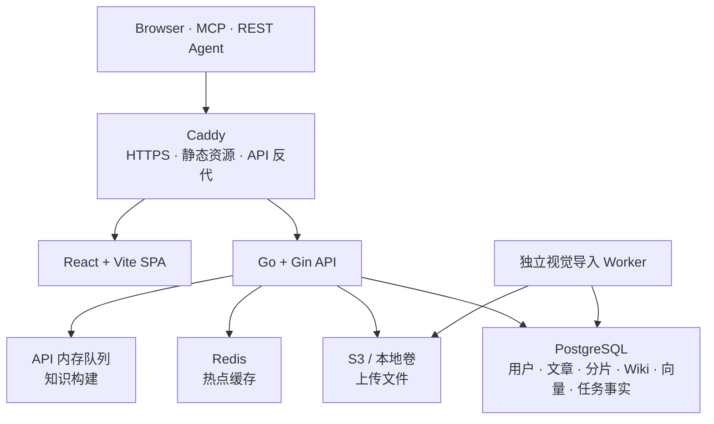
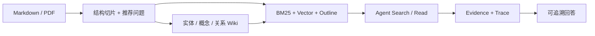

# Petrichor 文档中心

> [!TIP]
> 不必从头到尾阅读全部文档。先按目标选择路径，再在对应专题中深入实现、边界与排障细节。

这里是 Petrichor 的技术文档入口。README 提供项目级概览；`docs/` 保存可评审、可版本化的实现
说明；GitHub Wiki 则面向访客提供导航和精选内容。

> [!NOTE]
> 文档中的“产品内 Wiki”是 Petrichor 从文章编译出的知识层；仓库页面顶部的“Wiki”是 GitHub
> 项目文档栏，两者相互独立。

## 按目标选择阅读路径

### 🚀 我想部署或本地运行

1. [根 README](../README.md)：安装、配置、Compose 和常用命令。
2. [运维手册](./operations.md)：探针、优雅关停、Worker、指标和发布检查。
3. [数据库迁移](./database-migrations.md)：Goose 基线、自动迁移和首次管理员初始化。

### 🧠 我想理解知识与问答

1. [Agentic RAG 全流程](./agent/rag.md)：切片、推荐问题、Wiki、混合召回和 Evidence。
2. [AI 模型配置](./ai-model-setup.md)：Chat、Embedding 等模型用途绑定。
3. [知识可移植性](./knowledge-portability.md)：OKF、Obsidian、Skill 包和编译说明书。

### 🤖 我想理解 Agent Runtime

1. [Agent Runtime](./agent/runtime.md)：ReAct 循环、状态、预算、Trace 和安全边界。
2. [工具协议](./agent/tools.md)：命名空间、输入输出、确认票据与归一化。
3. [子 Agent](./agent/subagents.md) 与 [Skill 机制](./agent/skills.md)：委派和动态能力加载。
4. [调试指南](./agent/debug.md)：Run、Trace、Evidence 和常见故障。

### 🔌 我想接入外部客户端

1. [Claude Code / Codex / Cursor 接入](./agent/clients.md)：MCP 与 Skill 安装步骤。
2. [REST / MCP 集成设计](./agent/integration.md)：API Key scope、能力层和调用审计。

## 系统一览

生产部署只公开 Caddy。Go API 在监听前执行 Goose 迁移；视觉导入以 PostgreSQL 任务表为事实
来源，知识构建在 API 进程内的有界队列中运行。完整边界见 [运维手册](./operations.md)。

## 核心知识链路

算法、参数、降级路径和代码入口见
[《Petrichor Agentic RAG：从 Markdown 到可追溯回答》](./agent/rag.md)。

## 文档地图

### 知识与 RAG

- [`agent/rag.md`](./agent/rag.md)：数据进入、切片、推荐问题、产品内 Wiki、混合召回和新鲜度。
- [`knowledge-portability.md`](./knowledge-portability.md)：OKF / Obsidian、知识 Skill、编译说明书和陈旧检测。
- [`ai-model-setup.md`](./ai-model-setup.md)：Chat、Embedding 等模型用途绑定与供应商配置。

### Agent Runtime 与工具

- [`agent/runtime.md`](./agent/runtime.md)：主循环、状态、预算、Evidence、Trace、SSE 和安全边界。
- [`agent/tools.md`](./agent/tools.md)：工具命名空间、协议、确认票据与归一化。
- [`agent/subagents.md`](./agent/subagents.md)：复杂任务委派与子 Agent 协作。
- [`agent/skills.md`](./agent/skills.md)：动态 Skill 加载与工具集重建。
- [`agent/debug.md`](./agent/debug.md)：Run、Trace、Evidence 与故障排查。

### 外部 Agent 接入

- [`agent/clients.md`](./agent/clients.md)：Claude Code、Codex、Cursor 的 MCP 和 Skill 安装步骤。
- [`agent/integration.md`](./agent/integration.md)：REST 能力层、MCP Server、API Key scope 与审计设计。

### 数据库、部署与安全

- [`database-migrations.md`](./database-migrations.md)：Goose 基线、自动迁移和首次管理员初始化。
- [`operations.md`](./operations.md)：Compose、探针、优雅关停、Worker、指标与发布检查。
- [`../SECURITY.md`](../SECURITY.md)：漏洞报告、安全部署基线与依赖审计。
- [`202608270002_init.sql`](../apps/api/migrations/202608270002_init.sql)：完整数据库初始化基线。

## 文档维护约定

- 行为和参数以当前代码、`apps/api/config.example.toml` 与数据库迁移为事实来源。
- README 保持项目级概览；算法和边界放在 `docs/`，避免在首页复制完整实现说明。
- GitHub Wiki 是精选入口；`wiki/` 保存发布源，仓库内 `docs/` 仍是完整事实来源。
- 修改 RAG 实现时，同步检查切片参数、索引阶段、召回源、降级行为和代码位置。
