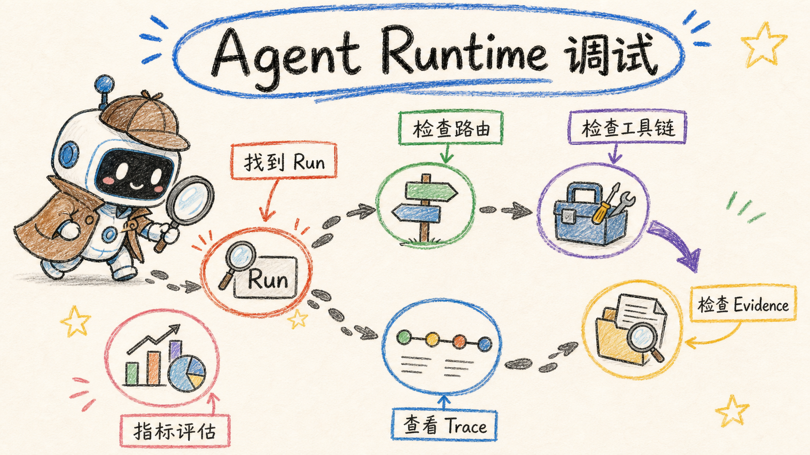

# Agent Runtime 调试指南

Agent Runtime 会把一次执行拆成 Run、Trace、Evidence 和 Subtask 四层审计数据。运行失败或回答
质量异常时，应先定位 `runId`，再沿事件序列检查路由、Skill、工具、证据和停止原因。

## 1. 调试入口与访问控制

前端入口：

```text
/dashboard/agent/debug
```

相关 API：

```text
POST /api/assistant/agent-run/list      { conversationId, limit? }
POST /api/assistant/agent-run/detail    { runId }
POST /api/assistant/agent-run/evidence  { runId }
POST /api/assistant/agent-run/trace     { runId }
```

- `list`、`detail`、`evidence` 只返回当前登录用户自己的 Run；
- `trace` 同样校验 Run 归属，并额外要求当前用户是 `SUPER_ADMIN`，或服务端启用
  `agent.features.debug`；
- 不满足 Trace 条件时返回 `agent_debug_disabled`。

配置示例：

```toml
[agent.features]
debug = true
```

不要使用 `AGENT_DEBUG` 环境变量：Go 服务不从环境变量读取 Agent 配置。

## 2. 持久化模型

| 表 | 主要内容 |
| --- | --- |
| `petrichor_agent_run` | 目标、复杂度、状态、停止原因、计划、Skill、token、时延与 Evaluation |
| `petrichor_agent_trace_event` | 同一 `run_key` 下按 `sequence` 排序的事件和工具结果 |
| `petrichor_agent_evidence` | 标题、摘要/正文、来源、相关度、置信度与定位信息 |
| `petrichor_agent_subtask` | 委派任务的目标、状态、深度、证据数与耗时 |

Run、Trace、Evidence 和 Subtask 各自 best-effort 持久化；审计表故障会记录结构化错误，但不会让
已经生成的回答失败。

## 3. 当前可观测事件

事件按单个 `runId` 的 `sequence` 单调递增。常见类型包括：

| 阶段 | 事件示例 |
| --- | --- |
| 生命周期 | `run_started`、`agent_started`、`agent_completed`、`agent_stopped`、`agent_error`、`agent_cancelled` |
| 路由与计划 | `complexity_detected`、`complexity_decided`、`routing_hint`、`plan_created`、`step_budget` |
| Skill 与委派 | `skill_loaded`、`delegation_started`、`delegation_completed`、`delegation_failed` |
| 工具 | `tool_started`、`tool_completed`、`tool_failed`、持久化后的 `tool_result` |
| 检索与证据 | `retrieval_diagnostics`、`evidence_created`、`observation_created`、`wiki_mention_targets` |
| 回答 | `final_answer_started`、`final_answer_delta`、`final_answer_completed`、`answer_quality_checked` |
| 安全与错误 | `prompt_injection_blocked`、`error`、`stop` |

普通聊天流只暴露公开 Observation、Evidence 和回答事件；完整 Trace 不进入模型上下文。

## 4. Metrics 与 Evaluation

Run 当前保存：

- `tool_call_count`、`iteration_count`、`delegation_count`；
- `input_tokens`、`output_tokens`、`total_tokens`；
- `duration_ms`；
- `metrics_json.latency`：TTFT、总耗时、LLM、工具、子 Agent、检索与重排的累计毫秒数。

流式完成事件还包含 `durationMs`、`toolCalls`、`evidenceCount`、`subAgentCount`、`iterations`。

当前 `eval_json` 是规则评估，不是模型评分，字段只有：

```text
score
status
stopReason
toolCalls
evidenceCount
answerChars
```

评分基于回答是否非空、是否获得 Evidence、是否出现致命/循环/无进展停止，以及工具调用量是否
过高。当前没有持久化 citation completeness、citation validity、no-tool-loop 等独立指标。

## 5. 推荐排障顺序

### 5.1 找到 Run

先从 SSE 的 `runId` 或 `/agent-run/list` 定位 Run，检查：

```text
status
stopReason
complexity
toolCallCount
iterationCount
delegationCount
durationMs
```

常见停止原因包括：

```text
goal_completed
enough_evidence
max_iterations
max_tool_calls
max_execution_time
no_progress
repeated_action
permission_denied
cancelled
fatal_error
```

### 5.2 检查路由与 Skill

查看 `routingHint`、`loadedSkills`、`skill_loaded`：

- 领域错误：检查 Soft Router 和路由置信度；
- Skill 未加载：检查 `agent.features.dynamic_skills`、Skill ID 和 `agent.load_skill` 结果；
- 工具不可见：检查 Skill 的 `ToolIDs` 是否已注册。

### 5.3 检查工具链

按 sequence 对照 `tool_started`、`tool_completed`、`tool_failed` 和持久化的 `tool_result`：

- `TOOL_VALIDATION_ERROR`：模型参数不满足 JSON Schema；
- `TOOL_PERMISSION_DENIED`：操作员、子 Agent 范围或业务资源权限不足；
- `TOOL_TIMEOUT`：检查工具级和 `agent.budget.tool_timeout_ms`；
- 重复参数调用：检查 `repeated_action` 与 `max_no_progress`。

### 5.4 检查 Evidence 与回答

- 工具成功但 Evidence 为 0：检查归一化器是否返回 Evidence；
- Evidence 相关度低：查看 `retrieval_diagnostics`；
- Evidence 正常但回答缺引用：检查最终合成提示和回答事件；
- 回答为空或截断：检查模型错误、token 使用和停止原因。

## 6. 日志与源码入口

结构化存储错误使用 `agent-runtime.store.*` 日志前缀。关键实现：

| 责任 | 文件 |
| --- | --- |
| Runtime 主循环 | `apps/api/internal/assistantsvc/runtime/runtime_run.go` |
| 流式事件与脱敏 | `apps/api/internal/assistantsvc/runtime/events.go` |
| 工具执行 | `apps/api/internal/assistantsvc/runtime/executor.go` |
| Run 持久化 | `apps/api/internal/assistantsvc/agentrun-store.go` |
| Debug 查询 | `apps/api/internal/assistantsvc/agentrun-view.go` |
| Debug 路由 | `apps/api/internal/assistantsvc/agentrun-handlers.go` |

生产环境不应仅为普通用户排障长期打开 `agent.features.debug`；优先由超级管理员查看 Trace，完成后
恢复为 `false`。
