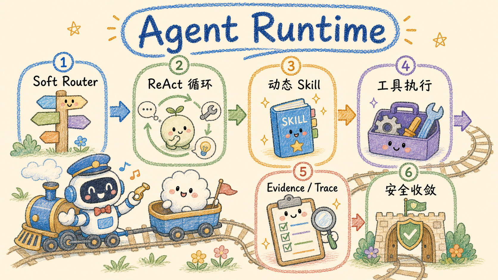

# Agent Runtime（Go + Pi）

Petrichor 的站内助手由 Go API 执行。它不是“先分类、再跑固定流程”的问答链，
而是一个持续决策的 Agent Runtime：Main Agent 根据目标选择工具、加载技能、拆分子任务，
并在证据、预算和安全策略允许的范围内自主收敛答案。

主要代码位置：

- `apps/api/internal/assistantsvc/runtime/`：状态、计划、Pi Agent Core、工具执行、证据、预算和停止策略。
- `apps/api/internal/assistantsvc/`：聊天接入、工具域、确认票据、持久化和 SSE 桥接。
- `apps/api/internal/aicore/`：多供应商模型、工具调用、流式协议和 Embedding 适配。
- `apps/api/internal/piruntime/`：统一 Pi 子进程协议、模型/工具回调、取消和进程回收。
- `apps/api/tools/pi-agent/`：固定版本 Pi Agent Core 运行器，独立 Bun 包。
- `apps/api/internal/aicore/document_pi.go`：Wiki 全文抽取和受限子 Agent。
- `apps/api/internal/assistantsvc/public_chat.go`、`public_tools.go`：前台公开问答入口与公开档位工具；`publicapi/agent_knowledge.go` 提供只读公开数据面，`publicapi/qa.go` 负责访客标识与配额。

## 框架边界

Pi Agent Core 负责标准的 `Model → Tools → Model` ReAct 循环。项目自己的 Runtime 继续掌握：

- 可序列化 State、Plan、Observation、Evidence 和 Trace；
- 权限判断、JSON Schema 校验、危险操作确认、超时与重试；
- 动态技能、子代理、上下文分区、循环检测、预算和停止策略；
- SSE/UIMessage 契约、敏感信息脱敏和完整 parts 持久化。

站内助手的 Pi 工具调用都通过统一 `ToolExecutor`，不能绕过权限、预算、Evidence 或 Trace。
需要动态加载技能时，当前 ReAct 段会被同步终止，再以新工具集重建下一段。

## Pi 接入与部署

运行器固定使用官方 `@earendil-works/pi-agent-core` 和 `@earendil-works/pi-ai` 0.87.0。
Pi 通过 SDK 的 `Agent` 管理模型与工具循环。Go 把现有模型网关适配成 Pi 的 `streamFn`，
模型配置、供应商兼容、密钥解密和 Embedding 保持唯一实现；不会把模型凭据交给子进程。

每个推理段或文档子任务使用独立的 Pi 进程，通过 LF 分隔的 JSONL 私有管道通信，
不开放监听端口，不加载 Pi CLI 的插件、个人配置、Shell 或宿主文件系统工具。
Go 对回调工具再次校验白名单；取消、停止策略和错误都会回收子进程。

本地首次开发或运行 Go 测试前执行 `bun run install:agent`。
`agent.pi.command` 默认 `bun`；`agent.pi.entry` 留空自动查找开发源码或镜像内的打包入口，
自定义部署可以填写绝对路径。API 与 Worker 的共享镜像自带 Bun、运行器和许可证，
Compose 不需要新增服务。修改 Pi 包后重建 API 镜像并更新 API/Worker。

当前采用 Pi 核心循环；会话持久化、技能、计划和权限由 Petrichor 的业务适配层管理。
没有启用 Pi CLI 会话目录，也没有向前端新增运行中插话接口。

## Wiki 文档 Agent

知识构建的 `DocumentAgentInvoker` 同样使用 Pi，支持 `read_file`、`ls`、`glob`、
`grep`、`write_file`、`edit_file`、`write_todos` 和 `task`：

- 文档正文和既有 Wiki 索引是内存虚拟文件，始终只读；阶段文件写入 `/work/`。
- 只有主 Agent 能写 `/output/result.json`，最终还要通过全文覆盖和来源校验。
- `read_file` 按实际读取行记录覆盖；搜索命中或模型声称已读不算完整读取。
- `task` 每批最多 3 路并行，总计最多 8 个子任务；子任务不能递归，单次最多 12 轮、2 分钟。
- 主任务、子任务、重试和上下文压缩共享 48 次模型调用预算。
- 上下文接近阈值时使用 Pi 的请求准备钩子压缩，保留目标、候选、chunkKey、文件和待办。
- Agent 未完成或覆盖校验失败时，保留原有连续分段全量抽取降级，避免构建漏掉正文。

Wiki 页面编译、视觉转写、Embedding 等单次模型调用继续走统一 Go 模型网关；
Asynq 队列、事务和 Wiki mutation 不属于 Agent 推理循环，保持现有业务执行方式。

## 公开文档问答

`/api/public/qa/chat` 与后台助手使用同一个 `PetrichorAgentRuntime`（意图、复杂度、计划、上下文、证据、
质量门与 Agent 事件流完全一致），只换成「公开档位」`RuntimeProfile`：独立的工具与技能注册表，外加一段公开问答边界说明。
公开档位只注册与后台同名、同入参、同归一化的知识检索工具（`lookup_knowledge`、`search_knowledge`、`read_knowledge_node(s)`、
`read_document_outline`、Wiki 概览/检索/阅读）和 Agent 元工具；执行体经 `publicapi` 只读取匿名公开文章与安全 Wiki，
不注册写入、记忆、文档库、系统、管理、MCP、沙箱与确认工具，由测试锁定工具清单。

公开范围在每次工具执行时实时加载，目录节点与 Wiki 页面均要求所有来源安全公开；同名 Wiki 页面用知识库 ID 精确定位。
检索复用公开搜索的全文、语义召回与 RRF，语义失败回退全文。访客只能提交普通 user/assistant 文本，
历史工具结果不会进入模型；单次运行限时 3 分钟。服务端不保存公开对话与运行记录，历史由访客浏览器保存。
具体入口与边界见 [RAG：三种问答入口](./rag.md#13-三种问答入口不要混淆)。

## 主循环

```text
User Goal
  ↓
复杂度识别 + Soft Router（只给提示，不裁剪能力）
  ↓
可选 Plan
  ↓
Context Manager（会话 / 技能 / 证据 / 观察分区预算）
  ↓
┌─ Pi Agent Core 段
│    Model → ToolExecutor → Observation / Evidence / Trace → Model
│    ↓
│  load_skill / StopPolicy 命中时结束本段
└─ 需要继续？用最新状态与工具集重建下一段
  ↓
证据和质量门检查；必要时执行无工具强制收敛
  ↓
唯一最终答案 + Run / Evidence / Trace / UIMessage parts 持久化
```

## 流式兼容契约

`POST /api/assistant/chat` 保持前端依赖的 AI SDK UIMessage 数据流结构：

1. 首帧是 `start`。
2. Agent 过程事件使用 `data-agent-event`，其 `data` 保持
   `{ runId, sequence, type, timestamp, payload }`；同一 Run 的 `sequence` 单调递增。
3. 过程推理文本只进入结构化事件，不伪装成最终回答。
4. 最终回答全程只产生一组
   `text-start → text-delta → text-end`，固定 id 为 `agent-answer`。
5. 正常和错误路径都以 `finish → [DONE]` 结束，`[DONE]` 永远是最后一帧。

SSE 写入由互斥锁串行化，避免模型回调、工具 Trace 和 Run 事件并发时交叉破坏帧。
写入数据库的 assistant message 不只保存纯文本，而是保存完整 `parts`：标准 text、
`data-agent-event`、已完成的 `tool-*` 输入/输出，以及 `agentRunId`、usage 和流耗时。
历史消息重新进入 Runtime 时会恢复已完成的工具调用与结果，确认卡执行结果不会丢失。

## 模型与供应商协议

| 供应商/协议 | 文本 | 流式 | 工具调用 | Embedding |
| --- | --- | --- | --- | --- |
| OpenAI 兼容 Chat Completions | 是 | 是 | 是 | 是 |
| OpenAI / xAI Responses API | 是 | 是 | 是 | 走供应商 Embedding 端点 |
| Anthropic Messages | 是 | 是 | 是 | 否 |
| Google Gemini | 是 | 是 | 是 | 是 |
| Azure OpenAI Chat / Responses | 是 | 是 | 是 | 是 |
| Google Vertex AI | 是 | 是 | 是 | `predict` / `embedContent` |
| Amazon Bedrock Converse | 是 | 是 | 是 | Titan / Cohere / Nova |

Azure 使用 `api-key`，官方 Azure 域按 `/v1` 和 `api-version` 路由，自定义网关保留自有路径。
Vertex 使用服务账号 JWT 换取并缓存 OAuth token。Bedrock 使用 AWS SDK v2 完成 SigV4、
临时 Session Token、Converse/ConverseStream 和 EventStream 解析。

## 工具与安全

工具按 `knowledge`、`document`、`research`、`memory`、`writer`、`admin`、
`system` 和 `agent` 命名空间注册。默认能力覆盖站内知识与 Wiki 检索/深读、文档库检索、
文章创建更新移动与分享、外部研究、长期记忆、写作、管理查询、动态技能与委派。

危险写操作必须先由服务端签发确认票据。票据绑定用户、线程、工具和参数摘要，经过加密保护，
并在消费时校验、防重放；模型自行声称“用户已确认”无效。工具输入、输出、SSE 和 Trace
在暴露给普通 UI 前统一脱敏，原始错误不会直接回传。

## 复杂度与默认预算

| 复杂度 | 迭代 | 工具调用 | 子代理 |
| --- | ---: | ---: | ---: |
| `direct` | 1 | 0 | 0 |
| `simple` | 5 | 6 | 0 |
| `multi_step` | 12 | 14 | 2 |
| `complex` | 24 | 32 | 5 |

复杂度只影响预算和是否生成计划，不限制 Agent 能加载的能力。停止条件包括执行时间、
token、工具调用、委派深度、重复循环和连续无进展；命中后优先收敛已有证据，而不是直接丢弃结果。

## 配置

Go 服务不读取 Agent 环境变量。功能开关和预算统一配置在
`apps/api/config.toml` 的 `[agent.features]`、`[agent.budget]`、
`[agent.budget.<complexity>]` 和 `[agent.research]`；完整字段见
`apps/api/config.example.toml`。

模型供应商、凭据、模型与场景绑定由数据库中的 AI 配置管理。

## 持久化与恢复

Run、计划、工具 Trace、Evidence、评价和统计写入 Agent Runtime 相关表。刷新页面后通过
`agent-run/detail` 恢复执行面板；当前不重连已经断开的 SSE，也不在后台重新启动同一个 Run。
数据库持久化异常按 fail-open 处理，不阻断当前回答，但会记录可诊断日志。

## 验证

```bash
bun run install:agent
bun run typecheck:agent
bun run test:agent
bun run build:agent
cd apps/api
go test ./...
go test -race ./internal/piruntime ./internal/aicore ./internal/assistantsvc/runtime ./internal/assistantsvc
go vet ./...

cd ../..
bun run typecheck
bun run lint
bun run build
```

协议测试覆盖唯一最终文本、`finish/[DONE]` 顺序、完整 parts、Pi 工具循环、动态技能、
委派、确认票据、脱敏，以及 OpenAI Responses、Azure、Vertex 和 Bedrock 的非流式/流式行为。
