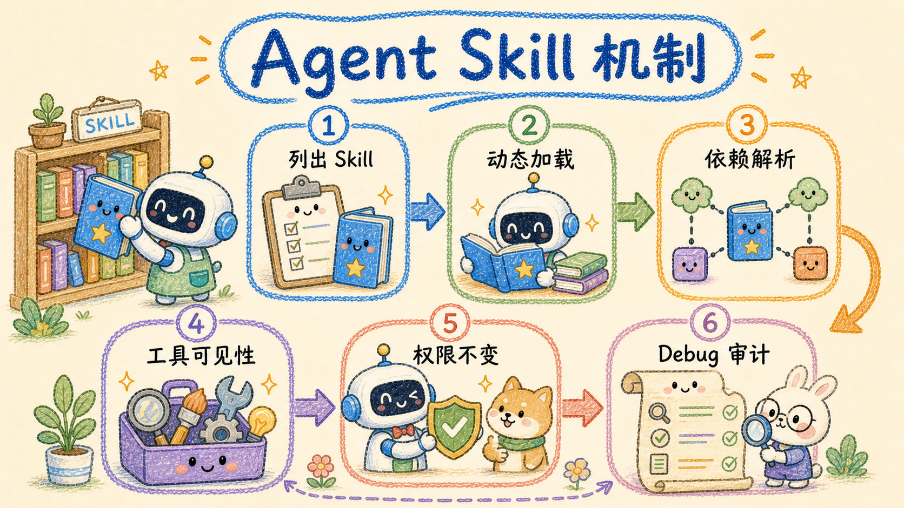

# Agent Skill 机制

本文描述产品内 Agent Runtime 的动态 Skill，不是外部客户端使用的 `/api/agent/skill` 文件。
运行时实现位于 `apps/api/internal/assistantsvc/runtime`，内置 Skill 在
`apps/api/internal/assistantsvc/tools_meta.go` 注册。

## 1. 为什么需要 Skill

Runtime 不把全部工具和详细指令一次性塞进模型上下文，而是分层暴露：

1. `agent.list_skills` 只展示 Skill ID 与一句话描述；
2. Agent 判断任务需要某个领域时调用 `agent.load_skill`；
3. Runtime 解析依赖链，把 Skill 标记为已加载；
4. 后续模型轮次加入该 Skill 的完整 `instructions` 和对应 `toolIds`；
5. 工具真正执行时仍经过权限、子 Agent 范围、超时和确认票据检查。

Skill 只扩大“可见能力”，不会绕过权限，也不会赋予子 Agent 新权限。

## 2. 当前内置 Skill

| Skill ID | 主要能力 |
| --- | --- |
| `knowledge` | 知识库列表、检索、定位、批量阅读、Wiki 与目录检索 |
| `research` | 外部搜索、页面抓取和正文要点提取 |
| `memory` | 用户记忆的检索、写入、更新和删除 |
| `graph` | 图谱搜索、扩展、实体与关系读取 |
| `writer` | 撰写、改写、摘要、结构梳理和保存写作产物 |
| `documents` | 文档库搜索/读写、导出、移动、分享与确认入口 |
| `admin` | 模型绑定、Agent Key 与公开问答状态管理 |
| `system` | 系统概览 |

Soft Router 的领域提示可预加载对应 Skill：

```text
knowledge              -> knowledge
doc_library/documents  -> documents
content_write/write    -> documents/writer
research               -> research
graph                  -> graph
memory                 -> memory
admin                   -> admin
system                  -> system
```

这只是提示与预加载映射，最终仍由 Runtime 的工具解析和权限检查决定可执行范围。

## 3. 注册新 Skill

先注册 Skill 引用的工具，再在 `registerBuiltinSkills` 中注册 Skill。例如：

```go
skills.Register(rt.AgentSkill{
    ID:           "analytics",
    Name:         "数据分析",
    Description:  "分析结构化数据并生成结论",
    Instructions: "先读取数据口径，再执行分析；不得猜测缺失字段。",
    ToolIDs:      []string{"analytics.query", "analytics.summarize"},
    Deps:         []string{"knowledge"},
    Tags:         []string{"analysis"},
})
```

字段含义：

| 字段 | 作用 |
| --- | --- |
| `ID` | 稳定的 Skill 标识，供 `agent.load_skill` 使用 |
| `Name` | 面向界面的名称 |
| `Description` | 能力目录中的短描述 |
| `Instructions` | Skill 加载后注入模型上下文的完整领域规则 |
| `ToolIDs` | 加载后加入候选集合的工具 ID |
| `Deps` | 需要先加载的其它 Skill ID |
| `Tags` | 可选分类标签 |

当前 Go 注册表会按依赖优先顺序解析，并用 `seen` 集合自动截断循环依赖。未知 Skill 返回
`SKILL_NOT_FOUND`；重复加载时，其 ID 会出现在 `AlreadyLoaded` 列表。

## 4. 约束与安全边界

- `ToolIDs` 必须引用已注册工具；当前注册表不会在启动时自动裁剪或报错，未注册 ID 最终不会形成
  可执行工具，因此新增 Skill 时必须依靠契约测试提前发现拼写错误；
- Skill 本身没有独立 `permissions` 字段；权限声明位于每个 `AgentToolDefinition`；
- 加载 Skill 后，工具执行仍经过 `PermissionResolver`；
- 子 Agent 只能使用父级允许工具与委派请求工具的交集；
- 有副作用、需确认或声明 `AllowedInSubAgent=false` 的工具不会交给子 Agent；
- 高风险操作只能先调用 `agent.request_confirmation` 获取服务端票据，再执行 `danger.*` 工具。

## 5. Debug 与审计

Skill 加载会进入以下观测面：

- 流式事件：`skill_loaded`；
- Run 状态：`loadedSkills`；
- Run 持久化：`petrichor_agent_run.loaded_skills_json`；
- Trace：`agent.load_skill` 的工具调用与结果。

排障时依次检查：

1. `agent.features.dynamic_skills` 是否启用；
2. Skill ID 是否出现在 `agent.list_skills`；
3. `agent.load_skill` 是否返回 `loaded=true`；
4. Skill 的 `ToolIDs` 是否已在工具注册表中注册；
5. 工具是否被权限、子 Agent 范围或确认策略拒绝。

工具协议与完整清单见 [工具协议](./tools.md)。
