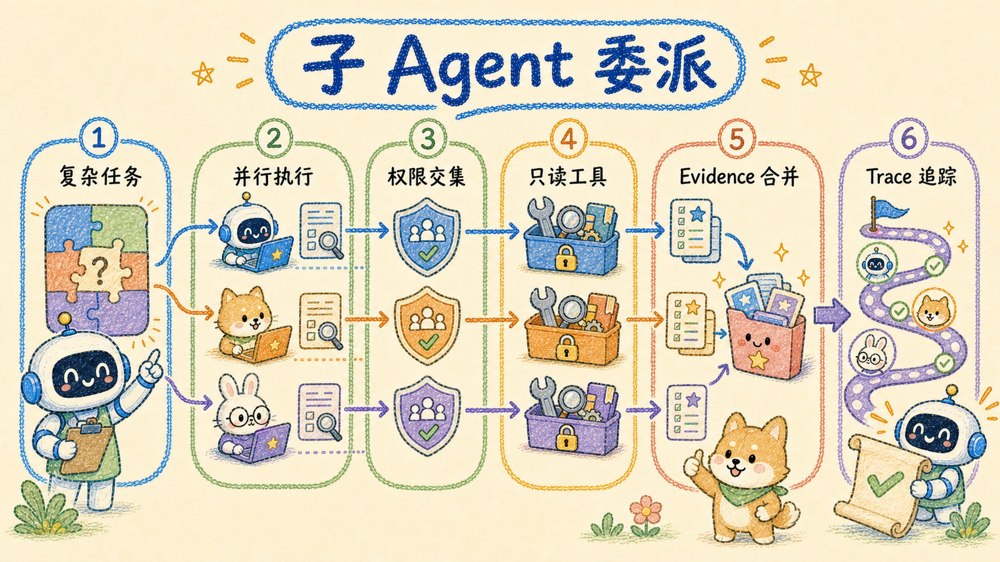

# 子 Agent 委派

产品内 Agent Runtime 通过 `agent.delegate` 把互不依赖的只读子任务并行执行。核心实现位于
`apps/api/internal/assistantsvc/runtime/delegation.go`，主循环接线位于
`apps/api/internal/assistantsvc/runtime/runtime_run.go`。

## 1. 何时可委派

必须同时满足：

- `agent.features.delegation = true`；
- 当前复杂度和停止策略允许委派；
- 委派深度未超过 `agent.budget.max_delegation_depth`；
- 本次 Run 的子任务数量预算未耗尽；
- 当前还有足够的总执行时间。

`direct` 与 `simple` 任务不允许委派。`complex` 默认子任务预算高于 `multi_step`；具体数值可由
`agent.budget` 覆盖。

## 2. 调用契约

```json
{
  "tasks": [
    {
      "objective": "核对 A 来源中的部署约束",
      "expectedOutput": "列出约束并附证据",
      "context": "主任务正在比较两种部署方案",
      "skillIds": ["knowledge"],
      "allowedToolIds": ["knowledge.search", "knowledge.read"],
      "maxToolCalls": 4
    }
  ]
}
```

当前约束：

- 每次最多提交 5 个任务；
- Runtime 最多并行执行 3 个；
- 每个子任务必须有明确 `objective`；
- `context`、`expectedOutput`、`skillIds` 和 `allowedToolIds` 都是可选约束；
- `maxToolCalls` 取值 1–12，缺省为 8；子任务超时还会被父 Run 的剩余 deadline 截短；
- 子 Agent 不会继续创建孙级任务；
- 委派开销也计入父 Run 的执行时间与子 Agent 预算。

## 3. 工具权限继承

子 Agent 的可用工具是三者交集：

```text
父用户在权限层可委派的工具
∩ 本次 allowedToolIds 或 skillIds 展开的工具
∩ 全局已注册工具
```

这里的父级集合是权限层可用集合，不要求对应 Skill 已在主 Agent 当前轮次加载；这不会提权，因为
主 Agent 本来就可以自行加载该 Skill。未给 `allowedToolIds` 和 `skillIds` 时，Runtime 从 knowledge、
research、document 命名空间选择无副作用的默认工具。随后继续经过 `PermissionResolver`。
以下工具不会进入子 Agent：

- `SideEffect=true` 的工具；
- `RequiresConfirmation=true` 的工具；
- `AllowedInSubAgent=false` 的工具；
- `agent.delegate`、计划修改、确认入口和全部 `danger.*` 工具。

因此即使 `allowedToolIds` 显式写入文章更新、分享、删除或管理工具，也不会获得执行权限。委派只会
收窄能力，不会提权。

## 4. 子任务输出

每个子任务返回：

```json
{
  "ok": true,
  "results": [
    {
      "taskId": "subtask-1",
      "status": "completed",
      "summary": "已找到 3 条部署约束",
      "evidenceCount": 2
    }
  ]
}
```

`agent.delegate` 的模型可见结果只包含任务摘要和证据数量。子任务生成的 Evidence 会另行合并回
父 Run 的 EvidenceStore，供最终回答引用；Trace 还会记录深度、耗时和工具调用。

## 5. 超时、取消与失败隔离

- 子任务使用 `agent.budget.subagent_timeout_ms`；
- HTTP 取消、父 Run 停止或总预算耗尽会通过 context 传播；
- 单个子任务失败不会自动让同批其它任务失败；
- 并行结果按输入顺序归位，而不是按完成顺序返回；
- 父 Agent 根据成功结果、失败状态和剩余预算决定继续检索或直接综合。

## 6. Trace 与持久化

委派过程产生：

```text
delegation_started
delegation_completed
delegation_failed
```

Trace 记录每个任务的状态、深度、证据数和耗时，并 best-effort 写入
`petrichor_agent_subtask`。Run 同时更新 `delegation_count`。

排障时检查：

1. `agent.features.delegation`；
2. 当前复杂度和 `max_delegation_depth`；
3. `max_subagents` 与剩余执行时间；
4. `allowedToolIds` 是否与父级工具集有交集；
5. 工具是否禁止子 Agent 或带副作用；
6. `delegation_started/completed` 和 `petrichor_agent_subtask`。

整体预算与停止原因见 [Agent Runtime](./runtime.md)。
