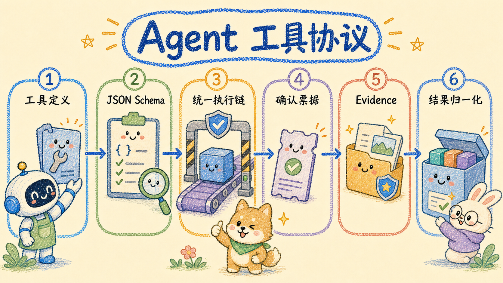

# Agent 工具协议

产品内 Agent Runtime 的工具注册表位于 `apps/api/internal/assistantsvc/runtime`，具体工具按领域
分布在 `apps/api/internal/assistantsvc/tools_*.go`。本文不描述外部 MCP 的 13 个工具；外部工具见
[客户端接入](./clients.md)。

## 1. 工具定义

每个工具使用 `runtime.AgentToolDefinition` 声明：

```go
type AgentToolDefinition struct {
    ID                   string
    Name                 string
    Namespace            ToolNamespace
    Description          string
    InputSchema          json.RawMessage
    Execute              func(ctx *ToolExecutionContext, input any) (any, error)
    Permissions          []string
    RiskLevel            ToolRiskLevel
    SideEffect           bool
    RequiresConfirmation bool
    AllowedInSubAgent    *bool
    RequiresOperator     bool
    Core                 bool
    Tags                 []string
    TimeoutMs            int64
    MaxRetries           int
    Normalize            ToolNormalizer
}
```

关键约定：

- `ID` 是运行时稳定 ID，例如 `knowledge.search`；
- `Name` 是暴露给模型的调用名，例如 `search_knowledge`；
- `InputSchema` 使用 JSON Schema，并在执行前校验；
- `Permissions` 当前支持 `assistant.operator`、`assistant.admin`、`assistant.write`、
  `assistant.memory.write`；
- `Core=true` 的工具无需加载 Skill；
- `SideEffect`、`RequiresConfirmation` 和 `AllowedInSubAgent` 共同决定委派边界；
- `TimeoutMs`、`MaxRetries` 未单独设置时使用 `agent.budget` 的全局值。

## 2. 当前工具清单

### Core 与 Agent 元工具

| 命名空间 | 工具 ID |
| --- | --- |
| `agent` | `agent.load_skill`、`agent.list_skills`、`agent.delegate`、`agent.get_plan`、`agent.update_plan`、`agent.request_confirmation` |
| `knowledge` | `knowledge.list_bases`、`knowledge.search`、`knowledge.lookup`、`knowledge.read_many`、`knowledge.read`、`knowledge.outline` |
| `system` | `system.overview` |

除 `agent.request_confirmation` 外，上表工具当前均标记为 Core。`direct` 复杂度不暴露工具；其它
复杂度默认暴露 Core 工具，并额外暴露三个 Wiki 读取工具。

### 按 Skill 加载的领域工具

| 领域 | 工具 ID |
| --- | --- |
| Wiki | `knowledge.wiki_overview`、`knowledge.search_wiki_pages`、`knowledge.read_wiki_page_detail` |
| 图谱 | `graph.search`、`graph.expand`、`graph.get_entity`、`graph.get_relations` |
| 研究 | `research.search`、`research.fetch`、`research.extract` |
| 记忆 | `memory.search`、`memory.write`、`memory.update`、`memory.delete` |
| 写作 | `writer.compose`、`writer.rewrite`、`writer.summarize`、`writer.structure`、`writer.save_artifact` |
| 文档 | `document.list_libraries`、`document.search`、`document.read`、`document.export`、`document.create`、`document.update`、`document.preview_update`、`document.move`、`document.share` |
| 管理 | `admin.list_models`、`admin.bind_model`、`admin.list_api_keys`、`admin.get_public_qa` |

当前服务端没有注册 `system.show_citations`、`system.show_data_table` 或 `system.show_progress`。
引用、进度和工具结果由结构化事件及前端渲染器展示，不是可由模型直接调用的系统工具。

### 高风险确认执行器

以下工具不会直接暴露给普通工具调用。Agent 必须先用 `agent.request_confirmation` 发起确认卡；
服务端原子消费确认票据后才会执行：

```text
danger.article_delete
danger.share_revoke
danger.document_delete
danger.ai_provider_delete
danger.ai_credential_update
danger.agent_api_key_revoke
danger.public_qa_set_enabled
```

它们均为高风险、有副作用、需要确认且禁止子 Agent 执行。

## 3. 执行链

工具调用按以下顺序处理：

1. 从当前可用工具集合解析模型输出的工具名；
2. 用 JSON Schema 校验参数；
3. 通过 `PermissionResolver` 检查操作员要求、权限和子 Agent 工具交集；
4. 检查确认票据；
5. 应用工具级或全局超时；
6. 仅对允许重试的错误执行局部重试；
7. 调用 `Normalize` 生成给模型的摘要、结构化数据、Evidence 和进度标记；
8. 写入 Trace、Observation 和流式事件。

工具错误统一归一化为：

```json
{
  "code": "TOOL_VALIDATION_ERROR",
  "message": "请求参数不完整",
  "retryable": false
}
```

常见代码包括 `TOOL_TIMEOUT`、`TOOL_PERMISSION_DENIED`、`TOOL_VALIDATION_ERROR`、
`TOOL_EXECUTION_ERROR` 和 `TOOL_ABORTED`。

## 4. Evidence 与归一化

检索/阅读工具不应把大段原始响应直接塞回上下文。`Normalize` 应返回：

- `Summary`：给模型的短摘要；
- `Data`：必要的结构化数据；
- `Evidence`：可引用的原文证据；
- `Progress`：这次调用是否带来新进展。

Runtime 会将 Evidence 放入独立存储，最终回答可引用其 ID；普通 UI 只接收脱敏后的
Observation/Evidence，完整参数和内部 Trace 只在受限调试接口中返回。

## 5. 新增工具检查清单

1. 在对应 `tools_*.go` 中定义 JSON Schema、执行器与归一化器；
2. 明确 `RiskLevel`、`SideEffect`、权限和子 Agent 策略；
3. 注册稳定 ID，并加入需要它的 Skill；
4. 若是高风险写操作，接入 `agent.request_confirmation` 和 `danger.*` 票据执行链；
5. 增加参数校验、权限、超时、归一化和契约测试；
6. 更新本文工具清单。

动态加载规则见 [Skill 机制](./skills.md)，委派限制见 [子 Agent](./subagents.md)。
