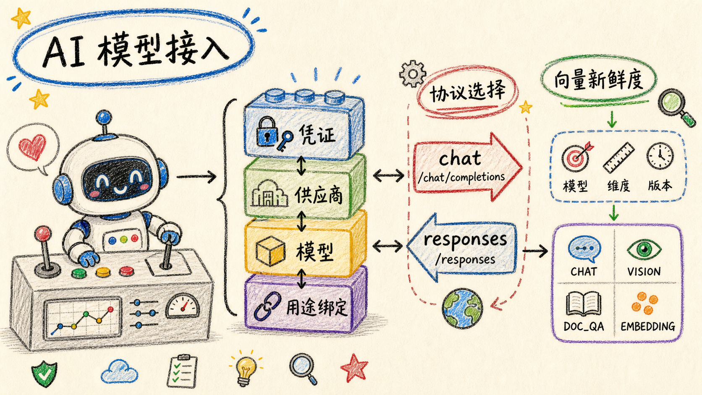

# AI 模型接入

## 数据模型

模型接入分四层，替代原先的单表 `petrichor_ai_model_config`：

| 表 | 职责 |
| --- | --- |
| `petrichor_ai_credential` | API Key 凭证库，一条凭证可被多个供应商实例复用 |
| `petrichor_ai_provider` | 供应商实例 = 目录里的某个供应商 + 一条凭证 + 可覆盖的 BaseUrl |
| `petrichor_ai_model` | 该供应商下已启用的模型，由「获取模型列表」写入 |
| `petrichor_ai_binding` | 用途绑定：CHAT / VISION / DOC_QA / EMBEDDING 各绑一个模型 |

业务代码只说「我要 CHAT 模型」，由 `apps/api/internal/aicore/resolve.go` 查出绑定 → 供应商 → 凭证，
再交给对应协议适配器实例化。换模型无需改代码。

## 配置流程

对应「模型配置」页的三个 Tab：

1. **凭证**：录入 API Key。一条凭证可被多个供应商复用，轮换只改一处。
   Bedrock / Vertex / Azure 这类需要额外字段（AK/SK、服务账号、资源名）的供应商，
   要在凭证里先选定供应商才会出现对应输入框。
2. **供应商**：从内置目录选一个供应商，默认 BaseUrl 会自动带出（可改成代理地址），
   选一条凭证后即可「测试连通」。保存后点「管理模型」拉取该供应商的 `/models`，
   勾选要启用的模型；拉不到时回退到内置模型清单。
3. **用途绑定**：把模型绑到四个用途上，并按用途设置 maxTokens、temperature、思考模式。

供应商目录定义在 `apps/api/internal/aisvc/catalog.go`；协议实现集中在
`apps/api/internal/aicore/`，新增供应商时需同步目录、协议能力和测试。

## 接口协议：chat completions 与 responses

语言模型有两套 HTTP 协议：

- `chat` → `POST {baseUrl}/chat/completions`
- `responses` → `POST {baseUrl}/responses`

**这个选择必须显式声明，不能依赖 SDK 默认值。** `@ai-sdk/openai` v4 起
`provider.languageModel(id)` 返回的是 Responses 模型，`azure` 和 `xai` 同理。
而绝大多数「OpenAI 兼容」的中转网关、私有部署和本地推理服务（one-api、new-api、
Ollama、LM Studio 等）只实现了 `/chat/completions`，用 SDK 默认值会直接 404。

因此：

- 目录里用 `apiProtocols` 声明该供应商支持哪几套，**第一项是默认值，一律为 `chat`**；
- 只有 OpenAI / Azure OpenAI / xAI 声明了两套，界面上才出现「接口协议」选择器；
- 用户的选择存在 `petrichor_ai_provider.options_json.apiProtocol`，
  由 `providerApiProtocol()` 读出，`resolveApiProtocol()` 对非法值和不支持的组合回落到默认值；
- Go 协议适配器据此显式选择 Chat Completions 或 Responses，不依赖 SDK 默认值；
- 「测试连通」会带上表单里当前选的协议，避免「测试通过、实际调用 404」。

其余供应商只有一套协议（Anthropic 的 `/v1/messages`、Gemini 原生接口、Bedrock 的 SigV4、
以及各家 OpenAI 兼容端点的 `/chat/completions`），走 SDK 统一入口即可。

供应商怪癖修正在 Go 协议适配层完成（例如 DeepSeek 的 json_schema 降级和 thinking 注入），
两套端点都会拦截——只匹配 `/chat/completions` 的话，换协议后修正会静默失效。

## 向量维度

维度不写死，由模型决定。

**模型侧**：绑定「向量嵌入」用途或在模型列表里点探测时，会发一次极短的 embed 请求
量出真实长度，写入 `petrichor_ai_model.dimensions`；真正 embed 时若发现实际长度
与记录不符（供应商同名换了实现），以实际为准自愈更新。

**存储侧**：向量列是无约束的 `vector`，不同维度的行可以共存。
索引采用**每维度一条部分表达式索引**：

```sql
create index ... using hnsw ((embedding::vector(N)) vector_cosine_ops)
where vector_dims(embedding) = N
```

新维度首次出现时由 Go 数据层自动创建维度索引。
查询侧必须带上 `vector_dims(embedding) = N` 过滤并对列做同样的转型才能命中该索引——
跨维度做 `<=>` 本来就会被 pgvector 拒绝，所以这个过滤是硬性要求而不是优化。

因此**换向量模型不需要清空数据**：旧维度的向量原样保留，只是会被判定为待重算。

维度超过 2000 时 pgvector 建不了 HNSW，检索退化为顺序扫描（功能仍正确，只是变慢）。
探测接口会在响应里返回 `indexable: false` 和一条说明。

### 新鲜度判定：为什么只看维度不够

维度相同不代表向量空间相同。两个都输出 1024 维的模型互换后，`vector_dims` 过滤
挡不住旧向量，检索会静默返回错误结果。所以有重算流程的表要比对三元组：

- `embedding_model` —— 哪个模型写的
- `embedding_dimensions` —— 实际维度
- `embedding_version` —— 分块/归一化策略版本（`EMBEDDING_VERSION`，改策略时 +1）

三者任一对不上就算待重算。目前 `petrichor_kb_article_chunk_index` 与存量兼容表
`petrichor_kb_wiki_tree_node` 都带这套元数据和「补写 / 重算」流程。前者还按
`chunk → question` 两阶段补写，分片向量未全部就绪时不会开始问题向量。
`petrichor_assistant_message_embedding` 是滚动的会话缓存，按维度过滤即可，过期条目
自然淘汰；`petrichor_agent_memory.embedding` 当前没有读写方。

## 数据库结构

模型、绑定和向量字段已经全部并入唯一的
`apps/api/migrations/202608270002_init.sql`，不需要再按顺序执行历史 SQL。Go API 启动时
会自动完成初始化；初始化后在“模型配置”页面添加供应商、模型和用途绑定即可。

从早期数据库升级时，旧的 `petrichor_ai_model_config` 会被清理，需要重新配置模型绑定。
来源不明的存量向量会被判定为待重算；在 Wiki 页面触发一次“生成向量”即可补齐。
