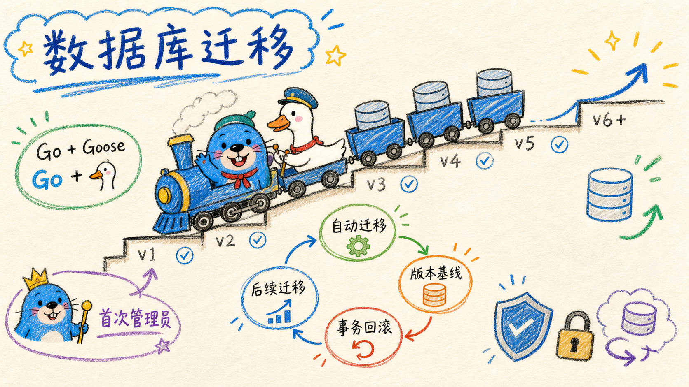

# 数据库初始化与迁移

数据库完全由 Go 和 Goose 管理，与 Bun、Web 构建和前端环境变量无关。

## 当前基线

`apps/api/migrations/202608270002_init.sql` 是完整数据库基线，包含：

- PostgreSQL `pg_trgm`、`vector`（pgvector）扩展和完整表结构；
- 当前索引、约束和最终字段；
- 只面向全新数据库的最终结构，不包含历史迁移、兼容回填和废弃对象清理；
- Sa-Token 所需的 `sa_token_storage` 持久化表；
- 不包含任何默认用户或默认密码。

Go API 在监听端口前自动执行 `provider.Up`。Goose 通过 `goose_db_version` 判断基线和后续
迁移是否已经应用；成功后记录版本，失败则回滚事务并终止 API 启动。

当前迁移目录还包含两份已经执行过、不可修改的 Worker 历史迁移：
`202608280001_knowledge_build_job.sql` 曾把知识构建任务状态持久化到 PostgreSQL，
`202608280002_worker_retry_and_dead_letter.sql` 为知识构建和视觉导入增加租约、重试与死信。
服务器后来迁移到 Asynq Redis 队列；`202608280003_drop_knowledge_build_job.sql` 删除旧知识构建
任务表，`202609020001_drop_document_import_jobs.sql` 删除旧视觉导入任务与页表。两个后台任务流的
运行态、重试和死信现在都只写 Redis；文章、切片、Wiki 页面、关系和向量索引不受影响。
第一次打开 Web 时必须自行设置管理员名称、登录邮箱和密码；初始化完成前，普通登录和受保护接口
都不会放行。初始化
接口使用 PostgreSQL 事务级 advisory lock，多个并发请求中最多只有一个能够创建首位超级管理员。

## 配置

执行器读取 `apps/api/config.toml`，优先使用 `[database].migration_url`，留空时回退到
`[database].url`。经 transaction pooler 连接 PostgreSQL 时使用 pgx `QueryExecModeExec`。

## 手动诊断命令

正常启动不需要手动迁移。排查时可以在 `apps/api` 下执行：

```bash
go run ./cmd/migrate status
go run ./cmd/migrate version
go run ./cmd/migrate up
```

## 后续结构变更

当前基线一旦在数据库执行就不可修改。后续结构调整必须新增更高版本的
`<纯数字版本>_<名称>.sql`，并加入 `-- +goose Up`。每个文件默认在独立事务中执行；
`CREATE INDEX CONCURRENTLY` 等不能放入事务的操作应作为单独运维步骤处理。
