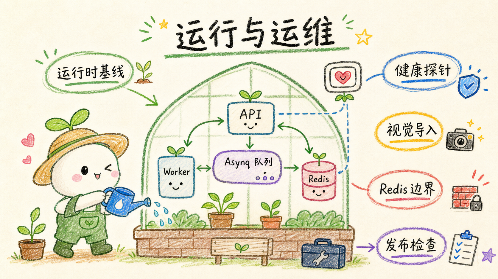

# 运行与运维

## 运行时基线

API 构建需要 Go `1.26.6` 或更新的安全补丁版本；Web 使用仓库 CI 固定的 Bun 版本。
Go API 启动时先执行 Goose 迁移，迁移失败不会监听端口；独立 Asynq Worker 必须在 API readiness
成功后启动，Compose 已通过依赖条件保证顺序。

生产配置至少确认：

- `[server].trusted_proxies` 只包含真实入口代理 IP/CIDR；
- `[database].max_conns >= 6`，默认 10；API 与 Worker 使用各自的 pgx 连接池；
- `[cache.redis].url = "redis://redis:6379/0"`，Redis 不发布公网端口；
- Redis 启用 AOF、使用 `noeviction`，并监控默认 1 GiB 内存上限；
- `[encryption]` 使用随机、稳定且非模板的 key/salt，并纳入密钥备份；
- HTTP 读取、响应头、空闲和优雅关闭超时保持有限值。

## 探针与关停

- `GET /healthz`：进程存活，不访问数据库；
- `GET /readyz`：数据库、缓存 Redis 与 Asynq Redis 均可用且迁移完成后返回成功；
- `GET /api/admin/runtime/metrics`：仅超级管理员可访问，返回 HTTP 聚合指标、pgx 连接池状态、
  两个 Asynq 队列状态和 Redis 中的视觉导入业务状态；
- `GET /api/admin/runtime/dead-letters`：列出耗尽自动重试的视觉导入业务任务；
- `POST /api/admin/runtime/dead-letters/replay`：重置指定视觉导入死信并重新写入 Asynq。

API 与 Worker 是独立进程。API 收到 `SIGTERM` / `SIGINT` 后停止接收新请求，不会取消 Redis 中
已经排队的任务。Worker 先停止周期调度，再并行关闭两个 Asynq Server；在途任务最多等待 90 秒，
超时后由 Asynq 重新交付。Compose 的 `stop_grace_period` 为 2 分钟，应始终大于 Worker 的关闭上限
和 API 的 `server.shutdown_timeout_seconds`。

## Asynq 队列

任务协议、入队去重和队列状态统一位于 `apps/api/internal/taskqueue`。当前只有两个业务队列：

| 队列 | 任务 | 默认并发 | 重试 / 保留 |
| --- | --- | ---: | --- |
| `knowledge_build` | 单篇文章知识构建 | 8 | 最多重试 2 次；单次 15 分钟；成功结果保留 1 小时 |
| `document_import` | 视觉文档导入 | 2 | 最多重试 4 次；单次上限 6 小时；Asynq 成功执行记录保留 24 小时 |

Asynq 是至少一次执行语义。两个任务流分别保证幂等：

1. 知识构建以“用户 + 知识库 + 文章”生成稳定的 Asynq TaskID，重复请求复用同一任务；最终写入仍走
   PostgreSQL 事务；
2. 视觉导入以 Redis 页状态跳过已经完成的页面，任务 ID 按导入记录稳定去重；成文前先在 Redis
   保存 PostgreSQL 文章序列预留 ID，进程在事务提交窗口崩溃后也不会重复创建文章；
3. Worker 异常中断后，Asynq 会重新交付；视觉页若停在 `processing`，下次处理先恢复为可运行状态；
4. 任务级可重试错误使用带稳定抖动、上限 5 分钟的指数退避；明确业务 4xx 不做无效重试；
5. 知识构建中的每次模型阶段调用另有最多 3 次的局部重试（1 秒、2 秒退避），只处理上游
   408/409/425/429/5xx、网络异常和非法 JSON；耗尽后才按阶段选择模板问题、既有目录或摘要页降级，
   不会仅因单个可降级页面失败而重跑整篇文章；
6. 每分钟执行一次补偿扫描，从 Redis runnable 索引把 API 更新状态后极小窗口内未成功入队的视觉任务重新入队。

## 知识构建并发

`[knowledge_build]` 控制知识构建队列和模型调用：

1. `concurrency = 8` 是 `knowledge_build` Asynq Server 的文章并发；
2. `queue_size = 128` 是 Redis 待处理任务软上限，不包含正在执行和已完成任务；
3. `question_batch_concurrency` 与 `page_batch_concurrency` 默认各 8 路；
4. 所有文章共享 `model_concurrency = 64` 的全局模型信号量，硬上限 128，避免嵌套任务池并发乘法；
5. Worker 按准备、文档分析、目录规划、Wiki 页面、事务写入、向量化阶段更新 Asynq task result；
   `POST /api/kb/knowledge/build/status` 返回 `progress.percent`、`phase`、`message` 和可选批次计数，
   前端轮询展示 0–100%，不额外创建业务状态键；
6. 调整时同时评估模型供应商限流、费用、Worker 内存和数据库连接池。

API 与 Worker 已通过 Redis 解耦，API 可以横向扩容。增加 Worker 副本会按副本数放大实际消费并发，
部署者必须同步评估模型额度；Compose 默认只运行一个 Worker 副本。

## 视觉导入业务状态

视觉导入任务、页面进度、失败原因和管理员死信全部以 Redis 为事实来源；PostgreSQL 只保存最终文章等业务数据：

1. Asynq 负责排队、在途任务、崩溃恢复和重试时间，`petrichor:document-import:*` 保存领域状态；
   Asynq 成功执行记录保留 24 小时，领域状态保留到用户删除导入记录、知识库或账号；
2. 页面默认最多尝试 5 次，与任务首次执行加 4 次重试一致；
3. 成功页立即写为 `done`，任务重放不会重复调用模型；
4. 明确业务失败写为 `failed`，重试耗尽写为 `dead_letter`；
5. 超级管理员可在“导入死信”页面重放；也可在 asynqmon 重试归档任务，Worker 会自动重置对应死信页。

排障时先打开 `http://127.0.0.1:8081` 查看 asynqmon，再检查 `/api/admin/runtime/metrics` 的队列与
业务状态计数，并按日志中的 `requestId`、`taskId`、`jobId`、`runId` 检索。不要直接手工修改视觉
导入状态或 Asynq Redis 键。asynqmon 没有内建业务认证，因此 Compose 只把它绑定到回环地址；远程
访问应使用 SSH 隧道，不要直接发布到公网。

## Redis 与任务边界

Redis 使用 `github.com/redis/go-redis/v9`，任务调度使用 `github.com/hibiken/asynq`。缓存和任务目前
共用 `[cache.redis]` 连接参数，但语义已经不同：缓存键允许过期，Asynq 键不可被驱逐。Compose 因此
启用 AOF（`appendfsync everysec`）与 `noeviction`；达到默认 1 GiB 上限时写入会失败并使 readiness
异常，而不是静默驱逐任务。可通过 `PETRICHOR_REDIS_MAXMEMORY` 调整，但必须按视觉页状态和任务保留量
预留容量。视觉导入领域状态不会随 Asynq 的 24 小时成功记录自动删除；高导入量环境应定期通过任务列表
批量删除不再需要的历史记录，或提高 Redis 容量。

不得对生产 Redis 执行 `FLUSHDB`、任意删除 `asynq:*`，也不要改回 `allkeys-lru`。Redis 数据卷应和
PostgreSQL、S3 数据、`config.toml` 一起备份。Redis 数据整体丢失时，未完成的视觉导入进度和知识
构建任务都无法从 PostgreSQL 补偿，必须恢复 Redis 备份或由用户重新发起；已经写入 PostgreSQL 的文章、
切片、Wiki 和向量数据不受影响。

## 静态资源

`bun run build` 会为可压缩资源生成 `.br` 与 `.gz` 文件；生产环境的 Caddy 优先发送预压缩
版本并设置长期静态资源缓存。本地 `apps/web/server.ts` 提供相同的 SPA 与 API 代理能力。CI 的
`bun run check:bundle` 同时检查：

- 首屏 JS/CSS Brotli 传输体积不超过 350 KiB；
- 单个 JS chunk Brotli 体积不超过 600 KiB；
- 大于 1 KiB 的 JS 都存在 Brotli/Gzip 版本；
- About 头像使用小体积 AVIF。

## Docker 运维

```bash
docker compose ps
docker compose logs -f api worker asynqmon
docker compose restart worker
docker compose run --rm api migrate status
docker compose pull redis
docker compose up -d --build
```

只允许 `web` 向公网暴露 80/443；API 的 8080 只通过 Compose `expose` 供 Caddy 使用，Redis 6379
与 asynqmon 8081 只绑定宿主机回环地址。`app-data`、`redis-data` 与 `caddy-data` 是具名卷，升级前应连同
PostgreSQL、S3 数据和 `config.toml` 一起纳入备份计划。

## 发布前检查

```bash
bun install --cwd apps/web --frozen-lockfile
bun run typecheck
bun run lint
bun run test:coverage
bun run audit:web
bun run build
bun run check:bundle
bun run check:size

cd apps/api
go test ./...
go test -race ./...
go vet ./...
go run golang.org/x/vuln/cmd/govulncheck@latest ./...
```

需要真实数据库的只读集成测试仍按各文档声明的环境开关单独执行。
